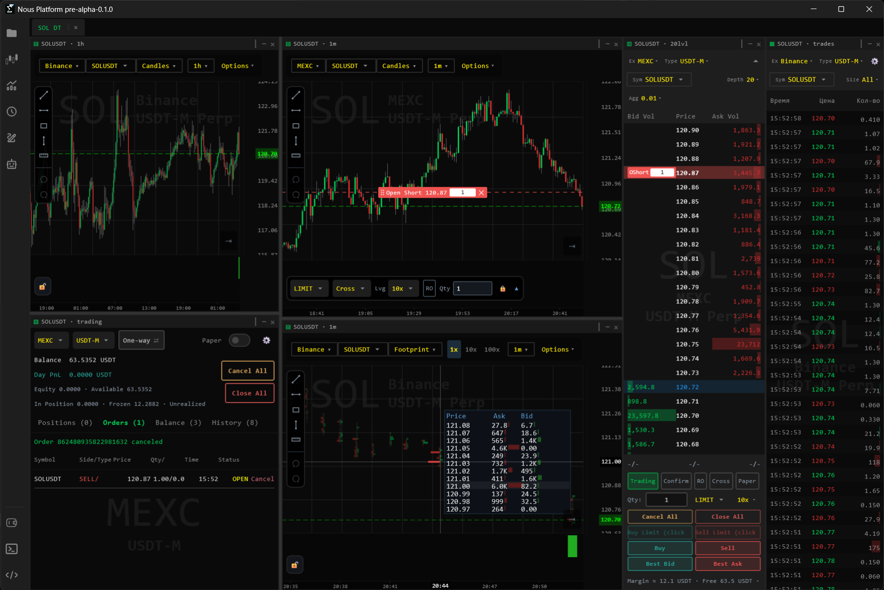
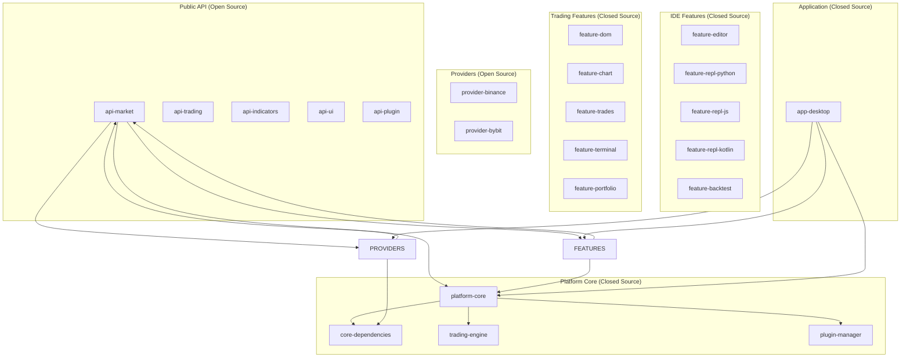
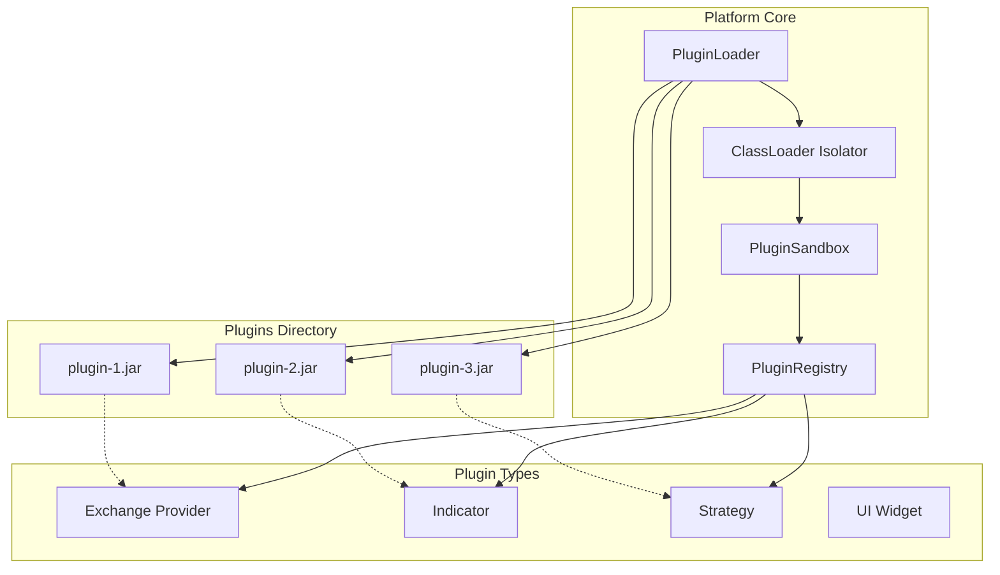

# Nous Platform v0.0.1 Pre-Alpha


***Project in active development***

> [!WARNING]
> **Live trading** and **paper trading** are not yet supported.

This ambitious project needs your active support! You can help out by donating, contributing, or submitting PRs (pull requests).

### Donate
***LTC Wallet:  ltc1qm9wsd82a4ak6wdy0936enptzntcaal2qwjc06a***

## Professional crypto terminal with Order Flow analysis and an open environment for strategies

[](https://kotlinlang.org)
[](https://github.com/JetBrains/compose-multiplatform)
[](LICENSE)

#### Exchange data collection service https://github.com/forskillzor/trade-collector-service
#### Market data service https://github.com/forskillzor/market-data-service
#### Platform specification [Nous-Platform-Technical-Specification-v1.0.md](docs/Nous-Platform-Technical-Specification-v1.0.md)
#### Documentation in Russian: [README.ru.md](README.ru.md) · [docs/ru/](docs/ru/)



## Table of Contents
1. [Introduction and product vision](#1)
2. [Business requirements and target audience](#2)
3. [Key features that go beyond standard terminals](#3)
4. [Development stages (Roadmap)](#4)
5. [Platform architecture](#5)
6. [Functional requirements](#6)
7. [Non-functional requirements](#7)
8. [Tech stack](#8)
9. [Project module structure](#9)
10. [Plugin system and ecosystem](#10)
11. [Security requirements](#11)
12. [UI requirements](#12)
13. [Data and storage requirements](#13)
14. [Integration with external systems](#14)
15. [Monetization and business model](#15)
16. [Development plan and estimates](#16)
17. [Risks and mitigation](#17)

---

## 1. Introduction and product vision <a name="1"></a>

### 1.1. Mission
Create a **professional integrated development environment (IDE) for trading** that combines the power of Order Flow analysis with full-fledged trading algorithm development. Nous Platform is not just a terminal — it is a **workspace for the trader-programmer**, where market analysis and strategy creation happen in a single space.

### 1.2. Vision
Nous Platform is an ecosystem built around **three pillars**:

1. **Analytical core** — professional Order Flow analysis tools: order book (DOM), Time & Sales (tape), Volume Profile, cluster charts, delta bars.
2. **Development environment (IDE)** — built-in code editor, REPL consoles for Python, JavaScript and Kotlin, DSL for indicators and strategies.
3. **Plugin ecosystem** — an open API for the community, a plugin marketplace, the ability to create and sell your own indicators, strategies and even complete trading bots.

### 1.3. Key differentiators from competitors

| Competitor | Weaknesses | Our advantage |
|-----------|------------|---------------|
| **ATAS / CScalp** | Not optimized for crypto, closed architecture, no development API | Native support for crypto exchanges, open API, ability to write your own indicators |
| **TradingView** | Not deep enough for Order Flow, no direct trading, limited Pine Script | Full order book, Time & Sales, Python/JS/Kotlin REPL, direct trading |
| **MetaTrader** | Outdated stack, MQL4/5, difficult crypto integration | Modern Kotlin, REPL, multi-language, crypto-first |
| **Jupyter + Binance API** | No ready-made UI, you have to build everything yourself | Ready interface with charts and order book, out-of-the-box integration |

---

## 2. Business requirements and target audience <a name="2"></a>

### 2.1. Target audience

#### Segment A: Professional crypto traders
- **Profile:** Trade spot and futures, use Volume Profile, Cluster Charts, DOM, Delta
- **Needs:** High performance, stability, direct market access, UI customization
- **Pain points:** ATAS is not optimized for crypto, TradingView is not deep enough for Order Flow analysis

#### Segment B: Algo traders and developers
- **Profile:** Write in Kotlin, Python, JS; create and test strategies
- **Needs:** Clear API, ability to quickly test hypotheses, backtesting
- **Pain points:** No single environment where you can view a chart and write code at the same time

#### Segment C: Technical analysts
- **Profile:** Analyze the market in depth, create complex indicators
- **Needs:** Access to raw data (order book, tape), ability to quickly prototype indicators
- **Pain points:** Jupyter is inconvenient for real-time, ready-made terminals don't provide raw data

### 2.2. Key user scenarios

1. **Analyst scenario:** Opened the order book, tape and chart → customized the display → analyzes market microstructure
2. **Developer scenario:** Opened the editor → wrote an indicator in Python → tested it in the REPL → added it to the chart
3. **Algo trader scenario:** Wrote a strategy in Kotlin → ran a backtest → saw the results on the chart → launched it in paper trading
4. **Researcher scenario:** Opened the REPL → requested historical data → built a model → visualized it on the chart

### 2.3. Business goals
- **Short-term (2026):** MVP launch with Binance and Bybit support, attracting the first 1000 active users
- **Mid-term (2027):** Building a plugin ecosystem, launching the marketplace, reaching self-sustainability
- **Long-term (2028+):** Becoming the standard for crypto algo trading, supporting all major exchanges through community plugins

---

## 3. Key features that go beyond standard terminals <a name="3"></a>

### 3.1. Integrated Development Environment (IDE)

#### 3.1.1. Code editor with syntax highlighting
- Based on **Monaco Editor** (the core of VS Code)
- Support for Kotlin, Python, JavaScript
- Autocompletion, navigation, refactoring
- Real-time error highlighting

#### 3.1.2. REPL consoles for three languages
- **Python REPL** based on the Jupyter Kernel (xeus-python)
- **JavaScript REPL** based on Node.js + VM2
- **Kotlin REPL** based on Kotlin Scripting
- Shared interface, command history, export
- Access to current market data directly from the console

#### 3.1.3. DSL for indicators and strategies
```kotlin
indicator("Volume Profile") {
    val period = parameter("period", 14)
    val levels = parameter("levels", 12)
    
    calculate {
        val poc = findPointOfControl(period)
        val valueArea = findValueArea(levels)
        plot("POC", poc)
        plot("VA High", valueArea.high)
        plot("VA Low", valueArea.low)
    }
}
```

### 3.2. Professional Order Flow analysis

#### 3.2.1. Cluster Charts
- Display of volumes at each price level within every candle
- Color coding of delta
- Configurable clustering depth

#### 3.2.2. Delta Bars
- Bars built on delta rather than time
- Ability to set a target delta value

#### 3.2.3. Volume Profile
- Horizontal volumes over a period
- Point of Control (POC)
- Value Area
- Ability to overlay multiple profiles

### 3.3. Plugin system as the foundation of the ecosystem

#### 3.3.1. Plugin types
- **Exchange providers** — add support for new exchanges
- **Indicators** — custom indicators for charts
- **Strategies** — trading strategies for backtesting and live trading
- **UI widgets** — custom windows and panels
- **Trading bots** — fully automated systems

#### 3.3.2. Example of an indicator plugin
```kotlin
class SuperTrend : Indicator {
    override val name = "SuperTrend"
    override val parameters = listOf(
        Parameter.int("period", 10, 5, 50),
        Parameter.float("multiplier", 3.0f, 1.0f, 5.0f)
    )
    
    override fun calculate(context: IndicatorContext): IndicatorResult {
        val atr = calculateATR(context.candles, context.period)
        // ... SuperTrend calculation
        return IndicatorResult.line(values, color = when {
            isUptrend -> Color.GREEN
            else -> Color.RED
        })
    }
}
```

### 3.4. Backtesting with visualization

#### 3.4.1. Loading historical data
- Automatic download from exchanges
- Local caching in SQLDelight
- Support for any timeframes

#### 3.4.2. Running strategies on history
- Configurable fees and slippage
- Detailed report: all trades, equity curve, drawdowns
- Visualization of trades directly on the chart

#### 3.4.3. Parameter optimization
- Grid search over specified ranges
- Visualization of the results surface
- Automatic selection of the best parameters

### 3.5. Next-generation trading journal

#### 3.5.1. Automatic trade import
- All trades are saved automatically
- Linking to chart screenshots
- Adding notes and tags

#### 3.5.2. Advanced statistics
- Win rate, profit factor, Sharpe ratio
- Distribution by time and days of the week
- Strategy performance analysis

#### 3.5.3. Report export
- PDF with charts
- CSV for analysis in Excel
- JSON for external systems

---

## 4. Development stages (Roadmap) <a name="4"></a>

### 4.1. Stage 0: Foundation (Q1-Q2 2026) — **CURRENT**
- Setting up the modular architecture according to the approved structure
- Creating `public-api` modules with base interfaces and models
- Implementing `platform-core` with business logic
- Developing the first feature modules (`feature-dom`, `feature-chart`, `feature-trades`)
- Migrating existing code into the new modules

### 4.2. Stage 1: MVP — Data reading and basic UI (Q2-Q3 2026)
- **Goal:** A working application for real-time market analysis
- **Features:**
    - Connection to Binance and Bybit (WebSocket + REST)
    - Order book (DOM) display with volume visualization
    - Time & Sales (tape) display
    - Candlestick chart with basic indicators (SMA, EMA, VWAP)
    - Draggable and resizable windows
    - Saving UI settings

### 4.3. Stage 2: IDE and plugin system (Q4 2026 - Q1 2027)
- **Goal:** Creating a development environment and ecosystem for developers
- **Features:**
    - Monaco Editor integration with Kotlin/Python/JS highlighting
    - Python REPL (Jupyter kernel)
    - JavaScript REPL (Node.js + VM2)
    - Kotlin REPL (Kotlin Scripting)
    - Loading external plugins
    - SDK and documentation for developers
    - Plugin examples (indicators, strategies)

### 4.4. Stage 3: DSL and backtesting (Q2-Q4 2027)
- **Goal:** A full-fledged platform for developing and testing strategies
- **Features:**
    - Domain-specific language (DSL) for indicators and strategies
    - Built-in editor with syntax highlighting
    - Backtesting on historical data
    - Visualization of trades on the chart
    - Trading journal with automatic trade import

### 4.5. Stage 4: Live Trading and ecosystem (2028+)
- **Goal:** A full-fledged trading platform with a marketplace
- **Features:**
    - Live trading with real orders
    - Risk management (stop-loss, take-profit)
    - Plugin marketplace with a rating system
    - Monetization (commission on plugin sales)
    - Support for new exchanges through community plugins

---

## 5. Platform architecture <a name="5"></a>

### 5.1. Overall architecture



### 5.2. Key architectural decisions

#### 5.2.1. Modularity as the foundation
- Each feature is a separate Gradle module
- Clear separation of public APIs and closed implementations
- Ability to replace any feature without changing the core

#### 5.2.2. Single source of truth for models
All data models live **only in the `public-api` modules**. This ensures:
- Data consistency across the entire platform
- The ability to use the same models in plugins
- No duplication or mapping

#### 5.2.3. Dependency inversion
- Feature modules depend only on `public-api` and `platform-core`
- Providers implement interfaces from `public-api`
- The App module wires everything together through DI

#### 5.2.4. Multiplatform with a desktop focus
- `commonMain` — business logic, models, interfaces
- `jvmMain` — platform-dependent code (network, file system)
- iOS and Android — in the future, for data viewing only

---

## 6. Functional requirements <a name="6"></a>

### 6.1. Data connection module (Data Providers)

#### 6.1.1. Base requirements
- Support for public WebSocket and REST APIs
- Automatic reconnection on connection loss
- Handling exchange rate limits
- Data caching to reduce load

#### 6.1.2. Supported exchanges (MVP)
- **Binance** (Spot & Futures)
    - WebSocket: order book, trades, candles
    - REST: historical candles, instrument information
- **Bybit** (Spot & Futures)
    - Similar functionality

#### 6.1.3. Provider API (interfaces in `public-api`)
```kotlin
interface MarketDataProvider {
    fun getSymbols(): Flow<List<Symbol>>
    fun getCandles(symbol: String, interval: Interval, limit: Int): Flow<List<Candle>>
    fun getOrderBook(symbol: String, limit: Int): Flow<OrderBook>
    fun getTrades(symbol: String): Flow<List<Trade>>
    fun getBestPrices(symbol: String): Flow<BestPrices>
}
```

### 6.2. Code editor module (`feature-editor`)

#### 6.2.1. Technical implementation
- Embedding Monaco Editor via WebView
- Two-way communication through a JavaScript Bridge
- Saving files to the local file system

#### 6.2.2. Functionality
- Syntax highlighting for Kotlin, Python, JavaScript
- Autocompletion for built-in APIs
- Code navigation (go to definition)
- Error highlighting
- Multiple tabs
- Saving/loading files
- Configurable theme (light/dark)

#### 6.2.3. Platform integration
- Access to current market data via global variables
- Ability to run code in the REPL directly from the editor
- Templates for indicators and strategies

### 6.3. REPL console modules (`feature-repl-*`)

#### 6.3.1. Common requirements
- A single interface for all three languages
- Command history (persisted between sessions)
- Syntax highlighting
- Autocompletion
- Execution timeout (protection against infinite loops)
- Execution isolation (sandbox)

#### 6.3.2. Python REPL
- Base interpreter based on the Jupyter Kernel (xeus-python)
- matplotlib support for chart output
- Access to market data via built-in variables

#### 6.3.3. JavaScript REPL
- Node.js with isolation via VM2
- Support for asynchronous code
- Access to the same data

#### 6.3.4. Kotlin REPL
- Kotlin Scripting with restricted reflection and file system access
- Coroutines support
- Access to built-in APIs

### 6.4. Display module (UI Features)

#### 6.4.1. Modular "Chart" window (`feature-chart`)
- Candlestick chart display with timeframe support: 1m, 5m, 15m, 30m, 1h, 4h, 1d, 1w
- Zooming and panning
- Delta bars display
- Basic indicators (SMA, EMA, VWAP, Volume Profile)
- Crosshair with candle information
- Drawing trend lines and levels

#### 6.4.2. Modular "Order Book" (DOM) window (`feature-dom`)
- Display of bids and asks with dynamic updates
- Volume visualization (horizontal bars)
- Order book depth setting (10-50 levels)
- Best price highlighting
- Spread display

#### 6.4.3. Modular "Order Flow" window (`feature-trades`)
- Real-time trade flow table
- Color coding: buys (green), sells (red)
- Highlighting large trades
- Trade aggregation by seconds/minutes

### 6.5. Backtesting module (`feature-backtest`)

#### 6.5.1. Data loading
- Automatic download of historical candles from the exchange
- Local caching in SQLDelight
- Support for any timeframes

#### 6.5.2. Running strategies
- Loading a strategy from a file
- Configuring fees and slippage
- Execution progress
- Detailed report

#### 6.5.3. Result visualization
- Displaying trades on the chart
- Equity curve
- Table of all trades
- Statistics (win rate, profit factor, drawdown)

---

## 7. Non-functional requirements <a name="7"></a>

### 7.1. Performance
- **Latency from an exchange event to the UI:** < 100 ms (ideally < 50 ms)
- **Chart FPS:** 60 FPS under normal load
- **Order book updates:** each update must be rendered in no more than 16 ms
- **Memory:** no more than 512 MB RAM under standard load
- **Application startup:** no more than 5 seconds
- **REPL startup:** no more than 2 seconds to readiness

### 7.2. Reliability
- **Uptime:** 99.9% (excluding exchange and internet connection issues)
- **WebSocket connections:** automatic reconnection with exponential backoff
- **Error handling:** all errors must be logged and must not crash the application
- **Graceful degradation:** if one component fails, the rest must keep working

### 7.3. Security
- **Plugins:** sandbox isolation, digital signature verification
- **API keys:** stored only locally in encrypted form (AES-256)
- **Network:** all connections over HTTPS/WSS only, with certificate pinning
- **REPL:** execution timeouts, no file system access outside the sandbox

### 7.4. Scalability
- **Horizontal:** ability to add new providers without changing the core
- **Vertical:** ability to add new features through plugins
- **Load:** support for up to 100 simultaneously open data windows

---

## 8. Tech stack <a name="8"></a>

### 8.1. Client side

| Component | Technology | Rationale |
|-----------|------------|-----------|
| **Language** | Kotlin Multiplatform | Single codebase for all platforms, safety, coroutines |
| **UI** | JetBrains Compose Desktop | Modern reactive UI, single codebase |
| **Architecture** | Clean Architecture + MVI | Clear separation of concerns |
| **DI** | Koin Annotations | Simplicity and performance |
| **Async** | Kotlin Coroutines + Flow | Built-in support |
| **Network** | Ktor Client | Multiplatform, simplicity |
| **WebSocket** | Ktor Client WebSockets | Unified API with HTTP |
| **Serialization** | kotlinx.serialization | Multiplatform, type safety |
| **Local storage** | SQLDelight | Type-safe SQL queries |
| **Code editor** | Monaco Editor (via WebView) | The core of VS Code, the most powerful editor |
| **Python REPL** | Jupyter Kernel (xeus-python) | Industry standard, proven solution |
| **JavaScript REPL** | Node.js + VM2 | Isolation, performance |
| **Kotlin REPL** | Kotlin Scripting | Official API |

### 8.2. Licensing (all compatible with the closed core)

| Component | License | Terms |
|-----------|---------|-------|
| Kotlin | Apache 2.0 | Can be closed-source |
| Compose Desktop | Apache 2.0 | Can be closed-source |
| Monaco Editor | MIT | Can be closed-source |
| Jupyter Kernels | BSD-3 | Can be closed-source |
| VM2 | MIT | Can be closed-source |
| Kotlin Scripting | Apache 2.0 | Can be closed-source |

---

## 9. Project module structure <a name="9"></a>

### 9.1. Full structure

```
Nous-Platform/
├── gradle/
│   └── libs.versions.toml
│
├── build-logic/
│   ├── build.gradle.kts
│   └── src/main/kotlin/conventions/
│       ├── KmpLibraryConvention.kt
│       ├── KmpFeatureConvention.kt
│       └── KmpApplicationConvention.kt
│
├── public-api/
│   ├── api-market/
│   ├── api-trading/
│   ├── api-indicators/
│   ├── api-ui/
│   └── api-plugin/
│
├── platform-core/
│   ├── build.gradle.kts
│   └── src/
│       ├── commonMain/kotlin/com/aandios/nous/core/
│       │   ├── domain/
│       │   ├── network/
│       │   ├── plugin/
│       │   └── di/
│       └── jvmMain/
│
├── features/
│   ├── feature-terminal/
│   ├── feature-dom/
│   ├── feature-chart/
│   ├── feature-trades/
│   ├── feature-portfolio/
│   ├── feature-editor/
│   ├── feature-repl-python/
│   ├── feature-repl-js/
│   ├── feature-repl-kotlin/
│   └── feature-backtest/
│
├── providers/
│   ├── provider-binance/
│   ├── provider-bybit/
│   └── provider-template/
│
├── app-desktop/
│   ├── build.gradle.kts
│   └── src/jvmMain/
│       ├── Main.kt
│       ├── di/
│       └── theme/
│
├── plugins/                    # Folder for JAR plugins (runtime)
│
├── docs/
│   ├── api/
│   ├── architecture/
│   └── decisions/
│
├── build.gradle.kts
├── settings.gradle.kts
└── gradle.properties
```

### 9.2. Convention plugins

```kotlin
// KmpLibraryConvention.kt
class KmpLibraryConvention : Plugin<Project> {
    override fun apply(target: Project) {
        with(target) {
            plugins.apply("org.jetbrains.kotlin.multiplatform")
            kotlin {
                jvm()
                sourceSets {
                    commonMain.dependencies {
                        implementation(libs.findLibrary("kotlinx-coroutines-core").get())
                    }
                }
            }
        }
    }
}

// KmpFeatureConvention.kt
class KmpFeatureConvention : Plugin<Project> {
    override fun apply(target: Project) {
        with(target) {
            plugins.apply("com.aandios.nous.library")
            dependencies {
                "commonMainImplementation"(project(":public-api:api-market"))
                "commonMainImplementation"(project(":platform-core"))
            }
        }
    }
}
```

---

## 10. Plugin system and ecosystem <a name="10"></a>

### 10.1. Plugin system architecture



### 10.2. Plugin loading process
1. Scanning the `/plugins` folder at startup
2. Verifying the digital signature (if required)
3. Creating an isolated ClassLoader
4. Loading the plugin classes
5. Finding classes that implement interfaces from `public-api`
6. Registering the plugin in the registry
7. Initializing the plugin in the sandbox

### 10.3. SDK for developers

#### 10.3.1. Documentation
- Complete description of all APIs in `public-api`
- Examples for each plugin type
- Guide to publishing on the marketplace

#### 10.3.2. Tools
- Project template for a new plugin
- Local test runner
- JAR signing tool

#### 10.3.3. Example indicator (ready for publication)
```kotlin
// build.gradle.kts
plugins {
    id("com.aandios.nous.plugin")
}

nousPlugin {
    name = "SuperTrend"
    version = "1.0.0"
    type = PluginType.INDICATOR
}

// src/main/kotlin/SuperTrend.kt
class SuperTrendPlugin : NousPlugin {
    override val id = "com.example.supertrend"
    override val name = "SuperTrend"
    override val version = "1.0.0"
    
    override fun create(): List<Any> = listOf(SuperTrendIndicator())
}

class SuperTrendIndicator : Indicator {
    override val name = "SuperTrend"
    override val parameters = listOf(
        IntParameter("period", 10),
        FloatParameter("multiplier", 3.0f)
    )
    
    override fun calculate(context: IndicatorContext): IndicatorResult {
        // implementation
    }
}
```

---

## 11. Security requirements <a name="11"></a>

### 11.1. Application-level security
- **Data encryption:** All local data (API keys, settings) is encrypted with AES-256
- **Least privilege:** The application does not request permissions beyond what is necessary
- **Updates:** Automatic update checks with signature verification

### 11.2. Network security
- **TLS:** All connections over HTTPS/WSS only
- **Certificate pinning:** For exchange connections
- **Certificate validation:** No self-signed certificates in production

### 11.3. API key security
- **Storage:** Keys are stored in the system key store (Keychain on macOS, Credential Manager on Windows)
- **Usage:** Keys are never transmitted to Nous Platform servers
- **Management:** Ability to add/remove/revoke keys

### 11.4. REPL security
| Language | Protection mechanism |
|----------|---------------------|
| **Python** | Isolated process, execution time limit, no file I/O |
| **JavaScript** | VM2 with restricted permissions, no `require` |
| **Kotlin** | Kotlin Scripting with restricted reflection and file system access |

**Operations forbidden in all REPLs:**
- Reading/writing files outside the working directory
- Executing system commands
- Creating network connections (except the terminal API)
- Infinite loops (5-second timeout)

---

## 12. UI requirements <a name="12"></a>

### 12.1. General principles

- **Dark theme** is used by default, as in all professional trading terminals. The user can switch to a light theme.
- **Customization** — ability to configure the color scheme, fonts and window layout.
- **Profiles** — saving and loading multiple UI settings profiles.
- **Monospace font** is used for all numeric data and tables, ensuring display consistency.

### 12.2. Main window structure

The terminal's main window is organized on the principle of **modular windows (MDI)** that can be moved, resized, closed and reopened. The window consists of the following areas:

- **Top toolbar** — contains:
  - Exchange selection (Binance, Bybit)
  - Trading instrument (symbol) selection with search and favorites
  - Timeframe selection (from 1 minute to 1 week)
  - Quick access buttons for tools (chart, order book, Time & Sales, settings)
  - Exchange connection status indicator

- **Main workspace** — divided into modular windows:
  - **Chart** — candlestick chart with indicators and drawing tools
  - **Order book (DOM)** — display of bids and asks with volume visualization
  - **Time & Sales (tape)** — real-time trade flow
  - Additional windows: portfolio, settings, trade history

- **Bottom status bar** — displays:
  - Exchange connection status
  - Latency in milliseconds
  - Current application version

### 12.3. Modular windows

All windows in the terminal are modular and have the following properties:

- Windows can be **undocked** from the main window and moved to other monitors (multi-monitor support).
- Windows can be **dragged** with the mouse and resized.
- Windows can be **collapsed** into the toolbar.
- Windows can be **closed** and reopened through the menu.
- **Window state** (position, size, open/closed) **is persisted** between sessions.

### 12.4. Color scheme

A dark theme is used (by default) with accent colors for fast visual perception:

| Element | Color | Purpose |
|---------|-------|---------|
| **Bullish (up)** | Green (#00C853) | Buys, uptrend, profit |
| **Bearish (down)** | Red (#D32F2F) | Sells, downtrend, loss |
| **Background** | Near-black (#0A0A0A) | Main application background |
| **Surfaces** | Dark gray (#121212) | Cards, panels, windows |
| **Text** | Light gray (#CCCCCC) | Main text |
| **Secondary text** | Gray (#888888) | Labels, auxiliary information |
| **Grid lines** | Dark gray (#333333) | Chart grid |

### 12.5. Typography

- **Primary font** — monospace (JetBrains Mono, Fira Code, Consolas).
- **Font sizes:**
  - Window titles: 16–20 px
  - Main text (tables, prices): 13–14 px
  - Auxiliary text (labels, captions): 11–12 px
  - Chart: 10–12 px (axis labels)

### 12.6. Hotkeys

All main actions have hotkeys for quick access:

| Combination | Action |
|-------------|--------|
| `Ctrl+N` | Open a new chart |
| `Ctrl+D` | Open the order book (DOM) |
| `Ctrl+T` | Open Time & Sales |
| `Ctrl+Tab` | Switch between open windows |
| `Ctrl+S` | Save settings / screenshot |
| `Ctrl+Z` | Undo the last action |
| `Ctrl+Y` | Redo the action |
| `F1` | Open help |
| `Esc` | Close the active window / clear selection |

The user can customize hotkeys in the settings section.

### 12.7. Internationalization

- Support for **English** and **Russian** languages.
- Language switching happens through settings without restarting the application.
- All numeric data is formatted according to the user's locale (thousands separators, decimal separators).

### 12.8. Interactive elements

- **Click** on a price in the order book opens the quick order window.
- **Double click** on an item in Time & Sales shows detailed information.
- **Drag & Drop** of panels between screen areas.
- **Scroll** on the chart — zooming.
- **Ctrl + Scroll** — smooth zooming.
- **Right click** on the chart opens a context menu with drawing tools and indicators.

### 12.9. Adaptivity

- The interface is optimized for resolutions from **1280x720** to **4K**.
- UI elements scale according to the screen DPI.
- Multi-monitor setups are supported (windows can be moved to additional screens).
```
## 13. Data and storage requirements <a name="13"></a>

### 13.1. Local storage

#### 13.1.1. Settings
- **Format:** JSON
- **Location:** `~/.nous/settings.json`
- **Contains:** UI settings, list of favorite instruments, hotkeys

#### 13.1.2. Trade history (journal)
- **Technology:** SQLDelight (SQLite)
- **Tables:**
    - `trades` — all trades
    - `notes` — notes on trades
    - `tags` — tags for categorization
    - `screenshots` — chart screenshots

#### 13.1.3. Historical data cache
- **Technology:** SQLDelight with time-based indexing
- **Storage:** Minute bars for the last 30 days for all favorite instruments

### 13.2. DB schema for history

```sql
-- Trades
CREATE TABLE trades (
    id TEXT PRIMARY KEY,
    symbol TEXT NOT NULL,
    side TEXT NOT NULL,
    quantity REAL NOT NULL,
    price REAL NOT NULL,
    timestamp INTEGER NOT NULL,
    fee REAL,
    fee_asset TEXT,
    pnl REAL,
    strategy TEXT,
    note_id TEXT
);

-- Notes
CREATE TABLE notes (
    id TEXT PRIMARY KEY,
    content TEXT NOT NULL,
    created_at INTEGER NOT NULL,
    updated_at INTEGER NOT NULL
);

-- Tags
CREATE TABLE tags (
    id TEXT PRIMARY KEY,
    name TEXT NOT NULL UNIQUE,
    color TEXT
);

-- Link between trades and tags
CREATE TABLE trade_tags (
    trade_id TEXT NOT NULL,
    tag_id TEXT NOT NULL,
    FOREIGN KEY(trade_id) REFERENCES trades(id),
    FOREIGN KEY(tag_id) REFERENCES tags(id)
);

-- Candle cache
CREATE TABLE candles (
    symbol TEXT NOT NULL,
    interval TEXT NOT NULL,
    timestamp INTEGER NOT NULL,
    open REAL NOT NULL,
    high REAL NOT NULL,
    low REAL NOT NULL,
    close REAL NOT NULL,
    volume REAL NOT NULL,
    PRIMARY KEY (symbol, interval, timestamp)
);
```

---

## 14. Integration with external systems <a name="14"></a>

### 14.1. Exchanges (MVP)
- **Binance** (Spot & Futures) — WebSocket + REST
- **Bybit** (Spot & Futures) — WebSocket + REST

### 14.2. Exchanges (planned via plugins)
- OKX
- Kraken
- Coinbase
- KuCoin
- Bitget
- HTX (Huobi)

### 14.3. Data export
- **CSV** — trades, candles, indicators
- **JSON** — for external APIs
- **PNG/JPEG** — chart screenshots
- **PDF** — reports and statistics

### 14.4. Data import
- **CSV** — historical data from other platforms
- **JSON** — settings, profiles, strategies

---

## 15. Monetization and business model <a name="15"></a>

### 15.1. Freemium model
- **Free:**
    - Reading data from Binance and Bybit
    - Basic charts and indicators (SMA, EMA, VWAP)
    - Order book (up to 10 levels)
    - Time & Sales
    - Python REPL (limited execution time)

- **Paid ("Pro" subscription):**
    - Advanced Volume Profile
    - Cluster charts
    - Backtesting
    - Kotlin and JavaScript REPL
    - Plugin system
    - Priority support

### 15.2. Plugin marketplace
- **For developers:**
    - Publishing paid plugins
    - 30% platform commission
    - Free plugins are allowed

- **For users:**
    - Buying plugins directly from developers
    - Ratings and reviews
    - Free trial period

### 15.3. Enterprise licenses
- **For funds and prop firms:**
    - White-label solutions
    - Dedicated servers for data aggregation
    - API for integration with internal systems
    - 24/7 priority support

> **Dual licensing:** the project is open-sourced under AGPL-3.0-or-later. Organizations that
> wish to use it without the AGPL obligations can obtain a commercial license — see the
> [License](#19) section.

### 15.4. Pricing model
- **Pro subscription:** $29.99/month or $299/year
- **Plugin commission:** 30%
- **Enterprise license:** from $5000/year

---

## 16. Development plan and estimates <a name="16"></a>

### 16.1. Team (ideal)
- **1 Lead Developer / Architect**
- **2 Backend/Kotlin Developers**
- **1 Frontend/Compose Developer**
- **1 DevOps (part-time)**
- **1 QA Engineer**

### 16.2. Stage estimates (person-hours)

| Stage | Tasks | PH |
|-------|-------|----|
| **Stage 0** | Architecture setup, convention plugins, base modules | 200 |
| **Stage 1** | Data providers, UI features, stable operation | 600 |
| **Stage 2** | Editor, REPL, plugin system | 500 |
| **Stage 3** | DSL, backtesting, journal | 400 |
| **Stage 4** | Live Trading, marketplace, scaling | 300 |
| **TOTAL** | | **2000** |

### 16.3. Detailed Stage 2 plan (IDE and plugins)

| Week | Tasks |
|------|-------|
| 1 | Monaco Editor integration, WebView setup |
| 2 | Creating `feature-editor`, file saving |
| 3 | Python REPL (Jupyter kernel) |
| 4 | JavaScript REPL (Node.js + VM2) |
| 5 | Kotlin REPL (Kotlin Scripting) |
| 6 | Plugin system: JAR loading |
| 7 | Plugin system: sandbox and security |
| 8 | SDK and documentation, plugin examples |

---

## 17. Risks and mitigation <a name="17"></a>

### 17.1. Technical risks

| Risk | Probability | Impact | Mitigation |
|------|-------------|--------|------------|
| Chart performance in Compose | High | High | Prototyping, benchmarks, fallback to a lightweight library |
| Complexity of Jupyter integration | Medium | Medium | Using ready-made solutions (xeus-python) |
| WebSocket issues | Medium | Medium | Automatic reconnect, monitoring |
| Memory leaks in REPL | Medium | High | Process isolation, timeouts, tests |

### 17.2. Business risks

| Risk | Probability | Impact | Mitigation |
|------|-------------|--------|------------|
| Low demand | Medium | High | Early MVP with feedback, niche focus |
| Competition | High | Medium | Focus on unique capabilities (IDE + plugins) |
| Exchange API changes | Medium | Medium | Provider abstraction, fast response |
| Regulatory risks | Low | High | Focus on non-custodial solutions |

---

## 18. Conclusion

Nous Platform is not just another terminal. It is a **professional working environment for the trader-developer**, where market analysis and algorithm creation happen in a single space.

Key advantages built into the architecture:
- **Modularity** — each component can be developed and tested independently
- **Openness** — the community can extend functionality through plugins
- **Performance** — the modern stack ensures high speed of operation
- **Flexibility** — REPL in three languages allows quickly testing hypotheses
- **Scalability** — the architecture is ready for functionality growth

This Technical Specification will serve as the primary development document and must be regularly updated as new architectural decisions are made.

---

**Nous Platform — built for those who don't just look at charts, but build their own future.**

© 2026 Aandios Labs

---

## 19. License <a name="19"></a>

Nous Platform is free and open-source software licensed under the
**GNU Affero General Public License, version 3.0 or later (AGPL-3.0-or-later)**.

The full license text is available in the [LICENSE](LICENSE) file.

All source files carry the following notice:

```text
Copyright (C) 2026 Sergey Orlov
SPDX-License-Identifier: AGPL-3.0-or-later
```

### Commercial license

AGPL-3.0 is a copyleft license: if you run a modified version of this software as a
network service, you must make your modifications available to its users under the same
license. If these obligations do not fit your business model, a **commercial license**
is available that removes them. Contact: <formyfrontend@gmail.com>.

### Contributions

Contributions are welcome — see [CONTRIBUTING.md](CONTRIBUTING.md) for build
instructions and the contribution workflow. By submitting a pull request, you
agree to the terms of the individual [Contributor License Agreement](CLA.md)
(CLA). The CLA allows Nous Platform to relicense contributions under the
commercial license, keeping the dual-licensing model intact.
