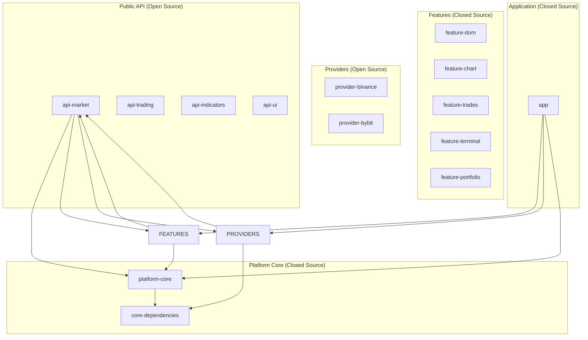

# Nous Platform v1.0 — Complete Technical Specification (updated)

## Table of Contents

1. [Introduction and product vision](#1)  
2. [Business requirements and target audience](#2)  
3. [Development stages (Roadmap) — UPDATED](#3)  
4. [Platform architecture](#4)  
5. [Functional requirements](#5)  
6. [Non-functional requirements](#6)  
7. [Technology stack](#7)  
8. [Modular project structure](#8)  
9. [Plugin system and ecosystem — POSTPONED](#9)  
10. [Security requirements](#10)  
11. [UI requirements](#11)  
12. [Data and storage requirements](#12)  
13. [Integration with external systems](#13)  
14. [Monetization and business model](#14)  
15. [Development plan (solo, 15 days/month) — UPDATED](#15)  
16. [Risks and mitigation strategies — EXTENDED](#16)  
17. [Conclusion](#17)  

---

## 1. Introduction and product vision <a name="1"></a>

### 1.1. Mission
To create a modern, modular, and open platform for professional crypto trading that combines the best practices of ATAS, CScalp, and MetaTrader, with a focus on crypto markets, delivering unprecedented customization and algorithmic trading capabilities.

### 1.2. Vision
Nous Platform is not just a terminal, but an ecosystem consisting of:
- **A powerful desktop application** for Order Flow analysis, Volume Profile, and cluster charts
- **An open API** for community-created plugins (after investment)
- **A domain-specific language (DSL)** for writing indicators and strategies (after investment)
- **A marketplace** for distributing paid and free plugins (after investment)

### 1.3. Key differentiators from competitors
1. **Live Trading from day one** — users can trade immediately, not just analyze
2. **Crypto focus** — optimized for Binance/Bybit, liquidation indicator, delta profile
3. **Modern technology stack** — Kotlin Multiplatform + Compose Desktop
4. **Cross-platform** — one codebase for Windows, macOS, and Linux
5. **Solo-friendly** — the project is structured so that a single developer can reach the first 1000 users

---

## 2. Business requirements and target audience <a name="2"></a>

### 2.1. Target audience

#### Segment A: Professional crypto traders
- **Characteristics:** Trade spot and futures, use Volume Profile, Cluster Charts, DOM, Delta
- **Needs:** High performance, stability, direct market access, UI customization
- **Pain points:** ATAS is not optimized for crypto, TradingView is not deep enough for Order Flow analysis

#### Segment B: Traders who need Live Trading
- **Characteristics:** Want to trade directly from the terminal instead of switching between the exchange and charts
- **Needs:** Fast order placement, position management, risk management
- **Pain points:** CScalp is limited, ATAS is hard to configure

### 2.2. Business goals (updated)
1. **Short-term (2026):** Launch Live Trading, attract the first 1000 active users, 50+ paying
2. **Mid-term (2027):** Attract Pre-Seed/Seed investment, expand the team to 3–4 people
3. **Long-term (2028+):** Build a plugin ecosystem, reach $2M+ ARR

### 2.3. Key performance indicators (KPI)
- Daily active users (DAU) — target 500 by end of 2026
- **Live Trading orders per day** — target 1000 by end of 2026
- Average time from exchange data receipt to UI display — under 300 ms
- Conversion to paid subscription — 5–10%

---

## 3. Development stages (Roadmap) — UPDATED <a name="3"></a>

**Key change:** Live Trading in Stage 1. Plugins, DSL, marketplace — only after investment.

### 3.1. Stage 0: Foundation (Q2 2026) — COMPLETED
- ✅ Modular architecture set up according to the approved structure
- ✅ Creation of `public-api` modules with base interfaces and models
- ✅ Implementation of `platform-core` with business logic
- ✅ Development of feature modules (`feature-dom`, `feature-chart`, `feature-trades`, `feature-localstorage`, `feature-settings`)
- ✅ Migration of existing code from `composeApp` to the new modules
- ✅ Adding WASM/JS targets to convention plugins (Kotlin Multiplatform)
- ✅ Moving Koin/ktor-client-cio from `commonMain` to `jvmMain` for WASM compatibility
- ✅ `expect`/`actual` patterns: HttpClientFactory, Platform.currentTimeMillis, ConcurrentMapFactory, Fonts
- ✅ Dependency updates: kotlinx-coroutines 1.9.0, kotlinx-serialization 1.7.3, kotlinx-datetime 0.6.1

### 3.2. Stage 1: MVP with Bidasker (Q2–Q3 2026) — IN PROGRESS

**Bidasker SaaS (freemium footprint chart):**
- ✅ `bidasker-web` module — Compose Multiplatform → Kotlin/JS (IR)
- ✅ Vue 3 Landing Page with iframe integration of the WASM/JS chart
- ✅ Tier system (Free/Registered/Pro) with JSON config
- ✅ Email registration (localStorage, prepared for API)
- ✅ GitHub Actions deploy to GitHub Pages
- ✅ 10x price-level aggregation for performance
- ✅ Loading via `onWasmReady()` — eliminating the race condition with Skiko WASM

**Live Trading + Analysis:**
- Connection to Binance and Bybit (WebSocket + REST) ✅ (Binance)
- Order book (DOM) display with volume visualization ✅
- Time & Sales display ✅
- Candlestick/footprint chart display ✅
- Draggable windows ✅
- Basic indicators (SMA, EMA, VWAP) ✅
- Chart drawing tools (Trend Line, Horizontal, Rectangle, Ruler) ✅
- Undo/Redo (Ctrl+Z/Y) ✅
- **Paper trading** (trade simulation)
- Liquidation support (forceOrder) — client and server ✅
- CORS on market-data-server ✅
- Saving UI settings

### 3.2b. Stage 1.5: Workspace & Tab System (Q3 2026) — PLANNED

**Goal:** An IDE-like workspace manager for trading

**Concept:** The user works with a Workspace — analogous to a project file. Each workspace describes: the exchange, the instrument, a set of panels (chart, DOM, trades), their layout, indicators, drawing objects. Workspaces are grouped in the Project Tree on the left, opened in the Tab Bar at the top, and can be detached into a separate window.

**Architecture:**
| Component | Role |
|-----------|------|
| **WorkspaceConfig** (JSON) | Serializable document: providers, layout, panels, drawings, indicators |
| **LayoutNode** | Recursive H/V split tree (Split/Leaf) — unlimited nesting depth |
| **ProjectTree** | Left panel: groups + workspaces, drag-and-drop reordering |
| **TabManager** | Tab management: open/close/activate/detach-to-window |
| **ProviderPool** | Global WebSocket connection pool with reference counting |
| **WorkspaceViewModel** | One workspace = one ViewModel with providers and panels |

**Implementation phases:**
1. **Foundation:** Data models (`@Serializable`), SQLite via SQLDelight, CRUD
2. **Core:** ProviderPool, WorkspaceVM, PanelVM, TabManager
3. **UI:** TerminalShell, ProjectTree, TabBar, LayoutRenderer (recursive splits), SplitHandle
4. **Interaction:** Compose Drag & Drop, Floating Window, WelcomeScreen, context menu
5. **Integration:** Replacing `MainScreen` with `TerminalShell`, backward compatibility

**Flexibility:**
- **Scalping setup:** Chart (1m) + DOM (20 levels) + Trades in one workspace
- **12x DOM Grid:** 12 DOM panels with different instruments in one workspace
- **Multi-provider:** Binance BTC chart + Bybit BTC DOM in one workspace

**Storage:** JSON in SQLite + export to `.workspace.json` for sharing.

**Why JSON and not a Kotlin DSL:** drawings, indicators, references to the journal/scripts are naturally stored in a JSON document. SQLite provides transactionality and atomicity. Migrations on update — add a field with a default.

### 3.3. Stage 2: Live Trading + Professional analysis (Q4 2026 – Q1 2027)
**Goal:** A full-fledged trading terminal with real money

**Features:**
- **Real trading on Binance/Bybit** (order placement, cancellation)
- **API key authorization** (locally encrypted storage)
- **Portfolio module** (balances, open positions, active orders, PnL)
- **Footprint / Delta** (cluster chart with per-price delta)
- **Delta Profile** (volume profile split into buys/sells)
- **Liquidation indicator** (estimation of liquidations from abnormal candles)
- Improved error handling and automatic WebSocket reconnection

### 3.4. Stage 3: First users and monetization (Q2 2027)
**Goal:** Attract 1000 MAU and 50+ paying subscribers

**Features:**
- **Public release** (website, documentation, onboarding)
- **Freemium model**:
  - Free: basic analysis, paper trading
  - Pro ($29.9/month or $299/year): Live Trading, Footprint, Delta Profile, liquidations
- Feedback collection, fast iterations
- Content marketing (YouTube, Twitter, Telegram)

### 3.5. Stage 4: Raising investment (Pre-Seed/Seed) — Q3–Q4 2027
**Goal:** Raise $100k–$500k to expand the team

**What investment provides:**
- Hiring 2–3 developers (3–4x acceleration)
- Professional marketing
- Legal structuring (international)

### 3.6. Stage 5: Ecosystem (2028+) — AFTER INVESTMENT
**Goal:** Become a platform for developers

**Features (deferred until the team is hired):**
- Plugin system (JAR loading, sandbox)
- SDK and developer documentation
- DSL for indicators and strategies (like Pine Script)
- Code editor with syntax highlighting
- Backtesting on historical data
- Plugin marketplace
- AI integrations

---

## 4. Platform architecture <a name="4"></a>

### 4.1. Overall architecture



### 4.2. Layers within modules

Each feature module has a clear separation into layers:

```
feature-*/src/commonMain/kotlin/com/aandios/nous/feature/xxx/
├── domain/                      # Business logic and interfaces
│   ├── models/                  # Data models (if feature-specific)
│   ├── repository/              # Repository interfaces (extend public-api)
│   └── usecases/                # Use cases (if complex logic)
│
├── data/                        # Repository implementations
│   ├── repository/               # Concrete implementations
│   ├── datasource/               # Data sources (local, remote)
│   └── mappers/                  # Mappers between models
│
├── presentation/                 # UI layer
│   ├── viewmodel/                # ViewModels
│   ├── state/                    # UI states
│   ├── components/               # UI components
│   └── navigation/                # Navigation within the feature
│
└── di/                           # DI module for the feature
    └── XxxModule.kt
```

### 4.3. Key architectural decisions

#### 4.3.1. Single source of truth for models
All data models live **only in `public-api` modules**. This ensures:
- Data consistency across the entire platform
- The ability to use the same models in plugins
- No duplication or mapping

#### 4.3.2. Separation of interfaces and implementations
- **Interfaces** — in `public-api` (visible to the community)
- **Implementations** — in `features/*/data` and `providers/*` (closed or open as needed)

#### 4.3.3. Dependency inversion
- Feature modules depend only on `public-api` and `platform-core`
- Providers implement interfaces from `public-api`
- The App module assembles everything together via DI

#### 4.3.4. Multiplatform support and KMP targets
- `commonMain` — business logic, models, interfaces, chart rendering
- `jvmMain` — desktop: Compose Desktop, Ktor CIO, Koin DI
- `jsMain` — web: Compose Multiplatform → Kotlin/JS (IR), Ktor fetch engine
- `wasmJsMain` — web (experimental): Compose Multiplatform → WASM, Ktor WASM engine
- iOS and Android — in the future

**Current status:**
- JVM (desktop): ✅ Production
- Kotlin/JS (web): ✅ Production (Bidasker SaaS)
- Kotlin/WASM (web): ⚠️ Experimental (Skiko WASM is unstable)
- iOS/Android: not started

---

## 5. Functional requirements <a name="5"></a>

### 5.1. Data connection module (Data Providers)

#### 5.1.1. Base requirements
- Support for public WebSocket and REST APIs
- Automatic reconnection on connection loss
- Exchange rate-limit handling
- Data caching to reduce load

Реализация rate-limit-защиты для Binance описана отдельно:
[Binance StreamHub: как работает WS-хаб и rate-limit защита](binance-stream-hub.md)

#### 5.1.2. Supported exchanges (MVP)
- **Binance** (Spot & Futures)
- **Bybit** (Spot & Futures)

#### 5.1.3. Provider APIs (interfaces in `public-api`)

```kotlin
interface MarketDataProvider {
    fun getSymbols(): Flow<List<Symbol>>
    fun getCandles(symbol: String, interval: Interval, limit: Int): Flow<List<Candle>>
    fun getOrderBook(symbol: String, limit: Int): Flow<OrderBook>
    fun getTrades(symbol: String): Flow<List<Trade>>
    fun getBestPrices(symbol: String): Flow<BestPrices>
}

// Added for Live Trading
interface TradingProvider {
    fun placeOrder(order: Order): Flow<OrderResult>
    fun cancelOrder(orderId: String): Flow<Boolean>
    fun getOpenOrders(symbol: String): Flow<List<Order>>
    fun getPositions(): Flow<List<Position>>
    fun getBalances(): Flow<List<Balance>>
}
```

### 5.2. Display module (UI Features)

#### 5.2.1. Main window (`feature-terminal`)
- Toolbar with icons for opening modular windows
- Exchange selection panel (Binance/Bybit) and market type (Spot/Futures)
- Trading instrument selection panel with search and favorites
- Timeframe selection panel
- Status bar with connection and latency information

#### 5.2.2. Modular "Chart" window (`feature-chart`)
- Candlestick chart display with timeframe support: 1m, 5m, 15m, 30m, 1h, 4h, 1d, 1w
- Zooming (scroll wheel) and panning (drag) ✅
- **Footprint Chart** (cluster mode: bid/ask volume by price level) ✅
- **Liquidation indicator** (triangular markers on candles: red down — long liquidation, green up — short) ✅
- Basic indicators: SMA, EMA, VWAP ✅
- Mode switching: candles, clusters (footprint) ✅
- Crosshair with O/H/L/C and candle volume display ✅
- **Chart drawing** (6 tools): ✅
  - **Trend Line** (trend line with handles at the ends)
  - **Horizontal Level** (horizontal level with price)
  - **Vertical Line** (vertical line at a timestamp)
  - **Rectangle** (rectangular zone)
  - **Ruler** (ruler: Δprice + Δtime + percentages)
- **Undo/Redo** (Ctrl+Z / Ctrl+Y) ✅
- NaN protection: `priceToY`/`priceFromY` do not crash on a zero price range ✅
- **Pluggable renderers** (in development): a `ChartRenderer` interface to swap candle types (CandleStick/Footprint/Bar) without changing the chart code

#### 5.2.3. Modular "Order Book" (DOM) window (`feature-dom`)
- Bid and ask display with dynamic updates
- Volume visualization (horizontal bars)
- Order book depth setting (10–50 levels)
- Best price highlighting (best bid/ask)
- Spread display in percent and absolute value
- **Quick order placement** (click on a price)

#### 5.2.4. Modular "Order Flow / Time & Sales" window (`feature-trades`)
- Real-time trade flow table
- Color coding: buys (green), sells (red)
- Highlighting of large trades (blocks)
- Filtering by minimum volume

#### 5.2.5. Modular "Portfolio" window (`feature-portfolio`) — Stage 2
- Balance display by asset
- List of open positions with PnL
- List of active orders with cancellation
- Trade history
- PnL charts and statistics

#### 5.2.6. Workspace & Tab System (Stage 1.5) — PLANNED
- **Project Tree** — left panel with a hierarchical list of workspaces grouped into folders
- **Tab Bar** — tabs (one tab = one workspace), switching, closing, detaching into a separate window
- **Layout Engine** — recursive H/V split grid (`Split/Leaf`). Unlimited nesting: a 12-DOM grid, or chart+DOM+trades in a standard scalping layout
- **Split Resizer** — draggable handle for changing split proportions
- **Panel Drag & Drop** — dragging panels between splits and workspaces (Compose DragAndDrop API)
- **Floating Window** — detaching a panel or an entire tab into a separate Compose `Window`
- **Workspace Config** — a JSON document describing providers, layout, panels, drawings, indicators
- **Templates** — predefined configurations: Scalping, DOM Grid, Order Flow, Empty
- **Welcome Screen** — start screen with templates, recent workspaces, tips
- **Provider Pool** — global WebSocket connection pool with reference counting. One provider (Binance+BTCUSDT) is shared across all workspaces
- **Persistence** — saving open tabs between sessions, restoring on startup
- **Export** — `.workspace.json` files for sharing between installations

### 5.3. Live Trading module (added)

#### 5.3.1. Order placement
- Limit orders (price + quantity)
- Market orders (quantity)
- Stop-loss and take-profit (attached to a position)

#### 5.3.2. Risk management
- Maximum position size
- Daily loss limit
- Confirmation before order submission

#### 5.3.3. Security
- API keys are stored in the system key store (Keychain/Credential Manager)
- Keys are never transmitted to Nous Platform servers
- Ability to delete/revoke keys

---

## 6. Non-functional requirements <a name="6"></a>

### 6.1. Performance
- **Latency from exchange event to UI:** < 300 ms (ideally < 100 ms)
- **Chart FPS:** 60 FPS under normal load
- **Order book updates:** each update must render in no more than 16 ms
- **Memory:** no more than 512 MB RAM under standard load
- **Application startup:** no more than 5 seconds

### 6.2. Reliability
- **Uptime:** 99.9% (excluding exchange and internet connection issues)
- **WebSocket connections:** automatic reconnection with exponential backoff
- **Error handling:** all errors must be logged and must not crash the application
- **Graceful degradation:** if one component fails, the rest must keep working

### 6.3. Scalability
- **Horizontal:** ability to add new providers without changing the core
- **Vertical:** ability to add new features via plugins
- **Load:** support for up to 100 simultaneously open data windows

### 6.4. Security
- **Plugins:** sandbox isolation, digital signature verification
- **API keys:** stored only locally in encrypted form
- **Network:** all connections over HTTPS/WSS only
- **User data:** no telemetry without consent

### 6.5. Usability
- **Interface:** customizable, with the ability to save profiles
- **Hotkeys:** full support for all actions
- **Internationalization:** support for at least English and Russian
- **Documentation:** built-in contextual help

### 6.6. Code quality
- **Test coverage:** at least 70% for core modules
- **Code style:** unified standard (ktlint)
- **Documentation:** all public APIs must be documented
- **CI/CD:** automatic build and testing on every commit

---

## 7. Technology stack <a name="7"></a>

### 7.1. Client side

| Component | Technology | Version | Rationale |
|-----------|------------|--------|-------------|
| Language | Kotlin Multiplatform | 2.3.0 | Single codebase for JVM + JS + WASM |
| UI | JetBrains Compose Multiplatform | 1.7.3 | Reactive UI, Canvas rendering |
| Architecture | Clean Architecture + MVI | — | Clear separation of concerns |
| DI | Koin | 3.5.6 | Simplicity, Compose integration |
| Async | Kotlin Coroutines + Flow | 1.9.0 | Built-in support |
| Networking | Ktor Client (CIO/fetch/WASM) | 3.4.1 | Multiplatform HTTP + WS |
| Serialization | kotlinx.serialization | 1.7.3 | Cross-platform type safety |
| Date/time | kotlinx-datetime | 0.6.1 | Cross-platform dates |
| Local storage | SQLDelight (JVM) + SQLite | — | Type-safe SQL queries |
| Web rendering | Skiko (Canvas → WebGL2) | 1.7.3 | Compose → Canvas in the browser |
| Web target | Kotlin/JS (IR) | 2.3.0 | Bidasker SaaS in production |
| Web target (exp) | Kotlin/WASM | 2.3.0 | Experimental |
| Vue.js | Vue 3 + Vite + TypeScript | 3.5 | Bidasker landing page |

### 7.2. Server side (backend infrastructure)

| Component | Technology | Version | Rationale |
|-----------|------------|--------|-------------|
| Trade Collector | Kotlin/JVM (Gradle) | 2.2.20 | Exchange data collection |
| HTTP server | Ktor Server (Jetty) | 3.2.0 | Monitoring and REST API |
| Database | PostgreSQL 16 | — | Per-symbol tables, JSONB |
| Connection Pool | HikariCP | 6.0.0 | High-performance pool |
| Statistics | t-Digest | 3.3 | Approximate percentiles, O(log n) |
| JSON (exchange) | Jackson | 2.15.0 | Binance WebSocket frame parsing |
| JSON (config) | kotlinx.serialization | 1.6.0 | Type-safe configuration |
| Market Data Server | Kotlin/JVM (Ktor/Jetty) | 2.2.20 | REST API for footprint data |
| Deploy | systemd + Makefile + SCP | — | Automatic deployment to VPS |

| Component | Technology | Rationale |
|-----------|------------|-------------|
| Backend | Ktor | Single stack with the client |
| Database | PostgreSQL + TimescaleDB | Optimization for time series |
| Cache | Redis | High performance |
| Queues | RabbitMQ / Kafka | For stream processing |

### 7.3. Development tools

| Tool | Purpose |
|------------|------------|
| Gradle | Project build |
| Version Catalog | Centralized version management |
| Convention plugins | Reusable build configurations |
| ktlint | Static code analysis |
| detekt | Additional analysis |
| GitHub Actions | CI/CD |

---

## 8. Modular project structure <a name="8"></a>

### 8.1. Full structure (current)

```
Nous-Platform/
├── gradle/
│   └── libs.versions.toml                             # Kotlin 2.3.0, Compose 1.7.3, Ktor 3.4.1
│
├── build-logic/
│   ├── build.gradle.kts
│   └── src/main/kotlin/conventions/
│       ├── KmpLibraryConvention.kt                    # jvm() + js(IR) + wasmJs()
│       ├── KmpFeatureConvention.kt                    # + Compose plugin
│       └── KmpApplicationConvention.kt                # + desktop app
│
├── public-api/
│   ├── api-market/                                    # Market models: Candle, Trade, FootprintCandle
│   ├── api-trading/                                   # Stubs (future trading)
│   └── api-ui/                                        # Stubs (future UI widgets)
│
├── platform-core/
│   ├── build.gradle.kts
│   └── src/
│       ├── commonMain/kotlin/com/aandios/nous/core/
│       │   ├── domain/repository/                     # ChartRepository, DomRepository, TradesRepository
│       │   ├── data/repository/                       # Implementations
│       │   ├── network/                               # NetworkManagerImpl, HttpClientFactory
│       │   ├── storage/                               # StateStore interface
│       │   └── ui/theme/                              # ChartColors, SymbolFormatter
│       ├── jvmMain/kotlin/                            # Platform.jvm, CoreModule (Koin)
│       ├── jsMain/kotlin/                             # Platform.js, Fonts.js
│       └── wasmJsMain/kotlin/                         # Platform.wasmJs, Fonts.wasmJs
│
├── core/
│   └── core-dependencies/                             # Shared deps: Ktor, Compose, kotlinx
│
├── features/
│   ├── feature-dom/                                   # Order book: DomViewModel, DomWindow
│   │   └── src/commonMain/                            # AggregationLevel, TradingSymbol
│   ├── feature-chart/                                 # Chart: ChartViewModel, CandleStickChart
│   │   └── src/commonMain/
│   │       ├── ui/chart/                              # ChartInteraction, CandleStickChart, DrawingOverlay
│   │       ├── rendering/                             # CandleRenderer, FootprintRenderer, Crosshair
│   │       ├── tools/                                 # Drawing, DrawingHistory, DrawingRenderer
│   │       ├── footprint/                             # FootprintApiClient, LiquidationApiClient
│   │       ├── indicator/                             # LiquidationViewModel
│   │       ├── model/                                 # ChartLayout, CandleMetrics, PriceRange
│   │       └── utils/                                 # ChartCalculator, Format
│   ├── feature-trades/                                # Trade tape: TradesViewModel, TradesWindow
│   ├── feature-localstorage/                          # SQLite storage (JVM only)
│   └── feature-settings/                              # Settings window (JVM only)
│
├── bidasker-web/                                      # ⭐ Bidasker SaaS footprint chart
│   ├── build.gradle.kts                               # js(IR) target
│   └── src/
│       ├── commonMain/kotlin/com/aandios/nous/bidasker/web/
│       │   ├── Main.kt                                # CanvasBasedWindow + URL params
│       │   ├── App.kt                                 # BidaskerApp composable
│       │   ├── Components.kt                          # FootprintToolbar, StatusBar
│       │   ├── DataLoader.kt                          # Ktor → market-data-server
│       │   └── TariffConfig.kt                        # Tariff limits
│       └── jsMain/resources/
│           └── index.html                             # onWasmReady + Skiko init
│
├── chart2/                                            # ⭐ New pluggable chart API (in development)
│   └── ChartRenderer.kt                               # Interface: CandleStick/Footprint/Bar renderers
│
├── providers/
│   ├── binance-provider/                              # Binance Futures adapters
│   │   └── src/
│   │       └── commonMain/                            # Chart, DOM, Trades, Liquidation adapters
│
├── composeApp/                                        # Desktop application
│   ├── build.gradle.kts
│   └── src/jvmMain/                                   # Main.kt, AppModule, TerminalLayout
│
├── docs/
│   ├── Nous-Platform-Technical-Specification-v1.0.md  # This document
│   ├── architecture/
│   ├── decisions/
│   └── vision/
│
├── plans/                                             # Development plans
│   └── workspace-tab-system.md                        # IDE-like tabs
│
├── build.gradle.kts
├── settings.gradle.kts
└── gradle.properties
```

### 8.2. Module descriptions

#### 8.2.1. `public-api/*` (Open Source)
- **Purpose:** The only place where public interfaces and models live
- **Visibility:** Fully open to the community
- **Contains:** Data models (Candle, Trade, FootprintCandle, LiquidationOrder), adapter interfaces, the Provider interface
- **Dependencies:** Kotlin Multiplatform + kotlinx.serialization + Ktor Client Core
- **Targets:** JVM ✅, JS ✅, WASM ✅

#### 8.2.2. `platform-core` (Closed Source)
- **Purpose:** Platform core with business logic, repositories, UI components
- **Contains:** Domain repositories (Chart/DOM/Trades), data implementations, NetworkManager, HttpClientFactory (`expect`/`actual`), ChartColors, SymbolFormatter, Terminal UI components
- **Dependencies:** `public-api`, `core-dependencies`, Compose Multiplatform
- **Targets:** JVM ✅, JS ✅, WASM ✅

#### 8.2.3. `features/*` (Closed Source)
- **feature-chart:** The most developed module. FootprintChart, CandleStickChart, Drawing tools (TrendLine/Horizontal/Rectangle/Ruler), Undo/Redo (Ctrl+Z/Y), FootprintApiClient, LiquidationApiClient, crosshair, zoom/pan
- **feature-dom:** DOM (order book) with Binance sync protocol, aggregation levels
- **feature-trades:** Time & Sales, size filter
- **feature-localstorage:** SQLite persistence (JVM only)
- **feature-settings:** Storage/settings UI (JVM only)
- **Targets:** JVM ✅, JS ✅ (chart/dom/trades), WASM ✅

#### 8.2.4. `bidasker-web` (Closed Source) — ⭐ new
- **Purpose:** SaaS footprint chart for the Bidasker landing page
- **Contains:** BidaskerApp composable, FootprintToolbar, Ktor HTTP client → market-data-server, tier limits, URL-param parsing
- **Reuses:** FootprintChart, FootprintRenderer, FootprintApiClient, AggregationLevel from features/chart and features/dom
- **Target:** Kotlin/JS (IR) — compiles to JS + Skiko WASM, embedded into Vue.js via iframe

#### 8.2.5. `chart2/` — ⭐ new (in development)
- **Purpose:** Next-gen pluggable chart API
- **Contains:** the `ChartRenderer` interface (CandleStickRenderer, FootprintRendererV2, BarRenderer), the `ChartOverlay` interface, `CrosshairOverlay`
- **Goal:** A universal TradingView-grade chart library — any candle/bar/footprint types via pluggable renderers

#### 8.2.6. `providers/*` (Open Source)
- **Purpose:** Adapters for specific exchanges
- **Contains:** WebSocket/REST clients for Binance Futures (aggTrade, forceOrder), Binance data models
- **Targets:** JVM ✅, JS ✅, WASM ✅

#### 8.2.7. `composeApp` (Closed Source)
- **Purpose:** Desktop application entry point
- **Contains:** `main.kt`, AppModule (Koin DI), TerminalLayout, MainScreen
- **Target:** JVM ✅ (desktop only)
- **Dependencies:** All feature modules, all provider modules

---

## 9. Plugin system and ecosystem — POSTPONED <a name="9"></a>

**Status:** Moved to the post-investment stage (2028+)

**Reason:** The implementation complexity (ClassLoader isolation, security, API design) would unjustifiably delay the Live Trading release. First, demand must be proven and the first paying users acquired.

---

## 10. Security requirements <a name="10"></a>

### 10.1. Application-level security
- **Data encryption:** All local data (API keys, settings) is encrypted
- **Least privilege:** The application does not request permissions beyond what is necessary

### 10.2. Network security
- **TLS:** All connections over HTTPS/WSS only
- **Certificate validation:** No self-signed certificates

### 10.3. API key security (critical for Live Trading)
- **Storage:** Keys are stored in the system key store (Keychain on macOS, Credential Manager on Windows)
- **Usage:** Keys are never transmitted to Nous Platform servers
- **Management:** Ability to add/delete/revoke keys

### 10.4. GDPR and privacy
- **Consent:** The user must explicitly consent to any analytics collection
- **Data minimization:** Only necessary data is collected
- **Right to be forgotten:** Ability to delete all data

---

## 11. UI requirements <a name="11"></a>

### 11.1. General principles
- **Dark theme:** Default, with the option to switch
- **Customization:** The user can customize colors, fonts, layout
- **Profiles:** Saving and loading multiple settings profiles

### 11.2. Modular windows
- All windows can be detached from the main window
- Windows can be dragged and resized
- Windows can be collapsed into the toolbar
- Window state is preserved between sessions

### 11.3. Color scheme

```kotlin
// Base colors
primary = "#00C853"      // Green (bullish)
secondary = "#D32F2F"    // Red (bearish)
background = "#0A0A0A"   // Almost black
surface = "#121212"      // Dark gray
onSurface = "#CCCCCC"    // Light gray text
```

### 11.4. Typography
- **Monospace font:** JetBrains Mono (default)
- **Sizes:** 
  - Headings: 16–20px
  - Body text: 13–14px
  - Secondary: 11–12px

### 11.5. Hotkeys
- `Ctrl+N` - New chart
- `Ctrl+D` - New order book
- `Ctrl+T` - New Order Flow
- `Ctrl+Tab` - Switch between windows
- `F1` - Help
- Full hotkey customization

---

## 12. Data and storage requirements <a name="12"></a>

### 12.1. Local storage

#### 12.1.1. Settings
- **Format:** JSON
- **Location:** `~/.nous-platform/settings.json`
- **Contains:** UI settings, list of favorite instruments, hotkeys

#### 12.1.2. Trade history (journal) — after investment
- **Format:** SQLDelight (SQLite)
- **Tables:** 
  - `trades` — all trades
  - `notes` — trade notes
  - `tags` — tags for categorization
  - `screenshots` — chart screenshots

#### 12.1.3. Historical data cache
- **Format:** SQLDelight with TimescaleDB-like extensions
- **Storage:** Minute bars for the last 30 days (for future backtesting)

### 12.2. Database schema for history (after investment)

```sql
-- Trades
CREATE TABLE trades (
    id TEXT PRIMARY KEY,
    symbol TEXT NOT NULL,
    side TEXT NOT NULL,
    quantity REAL NOT NULL,
    price REAL NOT NULL,
    timestamp INTEGER NOT NULL,
    fee REAL,
    fee_asset TEXT,
    note_id TEXT,
    strategy TEXT
);

-- Notes
CREATE TABLE notes (
    id TEXT PRIMARY KEY,
    content TEXT NOT NULL,
    created_at INTEGER NOT NULL,
    updated_at INTEGER NOT NULL
);

-- Tags
CREATE TABLE tags (
    id TEXT PRIMARY KEY,
    name TEXT NOT NULL UNIQUE,
    color TEXT
);

-- Trade-to-tag relations
CREATE TABLE trade_tags (
    trade_id TEXT NOT NULL,
    tag_id TEXT NOT NULL,
    FOREIGN KEY(trade_id) REFERENCES trades(id),
    FOREIGN KEY(tag_id) REFERENCES tags(id)
);
```

### 12.3. Exchange data caching

#### 12.3.1. Order book
- The latest snapshot is cached
- Incremental updates are applied to the cache

#### 12.3.2. Candles
- The last N candles are cached for each timeframe
- When switching timeframes, missing data is loaded

#### 12.3.3. Trades
- The last 1000 trades are cached
- On update, they are prepended to the list

---

## 13. Integration with external systems <a name="13"></a>

### 13.1. Exchanges (MVP)
- **Binance Futures** (REST + WebSocket) ✅ — `@aggTrade`, `@forceOrder`, `@kline`, `@depth@100ms`
- **Bybit** (REST + WebSocket) — adapter created, not activated in config

### 13.2. Exchanges (after investment)
- OKX, Kraken, Coinbase, KuCoin, Bitget (via community plugins)

### 13.3. Backend infrastructure (own services)

#### 13.3.1. trade-collector (Kotlin/JVM daemon)
- **Purpose:** Real-time collection, aggregation, and statistical analysis of crypto trades
- **Exchanges:** Binance Futures (50 perpetual symbols, top by daily volume)
- **WebSocket:** Combined stream (aggTrade + forceOrder), 100 streams in one TCP connection
- **Watchdog:** Multi-layer protection — Ktor pingInterval + application watchdog + exponential backoff
- **Database:** PostgreSQL 16 (per-symbol tables: raw_trades, aggregates, filtered_trades, volume_windows, liquidations, liquidation_aggregates)
- **Analytics:** t-Digest (volume statistics), footprint aggregation (1m + 15m), whale detection (>98th percentile)
- **Resilience:** Circuit Breaker, DiskBuffer, DeadLetterQueue, Watermark Recovery, Catch-up loop
- **Monitoring:** HTTP API (:8080) — /health, /metrics, /status, /api/logs, /api/instruments
- **Deploy:** systemd on VPS, `make deploy` (JAR → SCP → restart → health check)

#### 13.3.2. market-data-server (Ktor/Jetty REST API)
- **Purpose:** REST API for serving pre-aggregated footprint and liquidation data
- **Database:** PostgreSQL (reads tables created by trade-collector)
- **Endpoints:**
  - `GET /api/footprint` — footprint candles (bid/ask volume by price level)
  - `GET /api/instruments` — list of available instruments with candle counts
  - `GET /api/liquidations` — raw liquidations (timestamp, price, quantity, isLong)
  - `GET /api/liquidation-aggregates` — minute-aggregated liquidations
  - `GET /api/symbols`, `/api/timeframes`, `/health`
- **Deploy:** systemd on VPS (port 8085), `make deploy`

#### 13.3.3. Bidasker (Vue.js + Kotlin/JS SaaS)
- **Purpose:** Freemium footprint chart service, a funnel into Nous Platform
- **Frontend:** Vue 3 + Vite, iframe integration of the Kotlin/JS chart
- **Backend:** market-data-server REST API (tier limits via JSON config)
- **Deploy:** GitHub Pages + GitHub Actions

### 13.4. Data export (Caution: see exchange user agreements)
- CSV (trades, candles)
- JSON (for API)
- PNG/JPEG (chart screenshots)
- PDF (reports)

### 13.5. Data import
- CSV (historical data from other platforms)
- JSON (settings, profiles)

---

## 14. Monetization and business model <a name="14"></a>

### 14.1. Free model (Freemium)
- **Free:**
  - Reading data from exchanges
  - Basic charts and indicators
  - Order book and Order Flow
  - Paper trading

- **Paid ("Pro" subscription):**
  - **Live Trading** (real orders)
  - Footprint / Delta
  - Delta Profile
  - Liquidation indicator
  - Advanced portfolio module
  - Priority support

### 14.2. Pricing model
- **Pro subscription:** $29.9/month or $299/year
- **Free trial period:** 7 days

### 14.3. Marketplace and plugins — AFTER INVESTMENT

---

## 15. Development plan (solo, 15 days/month) — UPDATED <a name="15"></a>

### 15.1. Resource
- **15 days per month × 7 hours = 105 hours of code**
- Full-time equivalent: 60%

### 15.2. Detailed monthly plan

| Month | Tasks | Hours | Result |
|-------|--------|-------|-----------|
| 1 | Architecture, public-api, platform-core, convention plugins | 100 | Modular structure ready ✅ |
| 2 | Binance WebSocket, models, feature-dom (mock) | 100 | Exchange data flowing ✅ |
| 3 | Order book + Time & Sales + candlestick chart (real data) | 110 | Basic UI working ✅ |
| 4 | WASM/JS targets, Bidasker SaaS, trade-collector v3 | 110 | Web target + backend ✅ |
| 5 | Indicators (SMA, EMA, VWAP) + Footprint/Delta | 100 | Professional analysis ✅ |
| 6 | **Workspace & Tab System** (Phase 1–2: models + ViewModels) | 110 | Models, ProviderPool, TabManager |
| 7 | **Workspace & Tab System** (Phase 3–4: UI + interaction) | 110 | TerminalShell, Drag&Drop, Floating Windows |
| 8 | Drawing tools ✅ + UI polish + bug fixing | 100 | Stable version ✅ |
| 9 | **Live Trading** (order placement, keys, balance, portfolio) | 100 | First real trading |
| 10 | Liquidation indicator ✅, workspace integration, public release | 80 | Product in the wild |
| 11–12 | Feedback collection, requested features, optimization, growth | 100/month | 1000 MAU, 50+ paying |

### 15.3. Key milestones

| Month | Milestone |
|-------|------|
| 3 | Prototype with data ✅ |
| 4 | Bidasker SaaS + WASM/JS targets ✅ |
| 6 | **Workspace & Tab System (models)** |
| 7 | **Workspace & Tab System (UI)** |
| 8 | Chart drawing tools ✅ |
| 9 | **Live Trading ready** |
| 10 | **Public release** |
| 11 | First paid subscriptions |
| 12 | **1000 MAU, 50+ paying** |

### 15.4. What we do NOT do at the solo stage
- Plugin system
- DSL and code editor
- Backtesting
- Marketplace
- Support for 5+ exchanges (only Binance + Bybit)
- Complex animation
- Building our own chart from scratch

---

## 16. Risks and mitigation strategies — EXTENDED <a name="16"></a>

### 16.1. Technical risks (solo)

| Risk | Probability | Impact | Mitigation |
|------|-------------|---------|------------|
| **Burnout** | High (70%) | Critical | Clear schedule, weekends, sports, small wins every 2 weeks |
| **Complex WebSocket bugs** | Medium (40%) | High | Logging, auto-reconnection, REST fallback |
| **Chart performance issues** | High (60%) | High | Use a lightweight library, do not write a custom Canvas from scratch |
| **Memory leaks** | Medium (30%) | Medium | Profiling every 2 weeks |
| **API key security** | Low (10%) | Critical | Use the system key store, never log keys |
| **Errors in delta/footprint calculation** | Medium (40%) | High | Unit tests, comparison against reference data |
| **KMP compilation issues** | Medium (40%) | Medium | Use stable versions, do not chase updates |

### 16.2. Business risks

| Risk | Probability | Impact | Mitigation |
|------|-------------|---------|------------|
| **Low demand** | Medium (50%) | High | Launch the MVP quickly, survey traders beforehand |
| **Users unwilling to pay for Live Trading** | Medium (40%) | High | 7-day free trial, collect feedback |
| **Competitors (ATAS, CScalp, TradingView)** | High (70%) | Medium | Unique advantage — Live Trading + crypto + footprint |
| **Exchange API changes** | Low (10%) | Medium | Provider abstraction, fast response |
| **Regulatory risks** | Low (5%) | High | We do not hold user funds, only API keys |
| **API keys blocked by the exchange** | Low (10%) | Medium | Strict rate-limit compliance, no abuse |

### 16.3. Time and focus risks

| Risk | Probability | Impact | Mitigation |
|------|-------------|---------|------------|
| **Distraction by daily life/work** | High (80%) | Medium | Reserve 2 full days per week for code only |
| **Loss of motivation** | Medium (40%) | High | Small wins, early release, feedback |
| **Perfectionism** | Very high (90%) | Critical | "Dirty but working" beats perfect but unfinished |
| **Wrong time estimates** | High (70%) | Medium | Add a 30% buffer to every estimate |

### 16.4. Community and marketing risks

| Risk | Probability | Impact | Mitigation |
|------|-------------|---------|------------|
| **Nobody finds out about the product** | High (60%) | High | Produce content (YouTube, Twitter, Telegram) from month 1 |
| **Negative feedback** | Medium (50%) | Medium | Fix bugs fast, do not ignore users |
| **Toxic community** | Low (20%) | Low | Moderation, clear rules |

### 16.5. Financial risks (before investment)

| Risk | Probability | Impact | Mitigation |
|------|-------------|---------|------------|
| **Not enough money to live** | Depends on the situation | Critical | Have a 12-month reserve, side work, freelancing |
| **Nobody buys the Pro subscription** | Medium (40%) | High | Reconsider pricing, add more features to the free tier |
| **Investors do not come in** | Medium (50%) | High | Bootstrap longer, look for grants, bounty programs |

### 16.6. Exit strategy for critical risks

| Scenario | Action |
|----------|----------|
| Burnout | Take a 1–2 week break, lower expectations |
| Product does not take off 6 months after release | Pivot: build a tool for a specific niche (e.g., liquidations only) |
| Competitors ship a similar feature | Strengthen the unique advantage (speed, simplicity, support) |
| No paying users | Accept donations, open part of the Pro code |

---

## 17. Conclusion <a name="17"></a>

**Nous Platform v1.1** is a realistic plan for a solo developer:

- **6 months** to first Live Trading
- **8 months** to public release
- **12 months** to 1000 users and 50+ paid subscriptions
- **After that** — raising investment and scaling

**Key principle:**  
First a working product and live users.  
Then the ecosystem, plugins, DSL, and marketplace.

**The document will be updated as stages are completed.**
