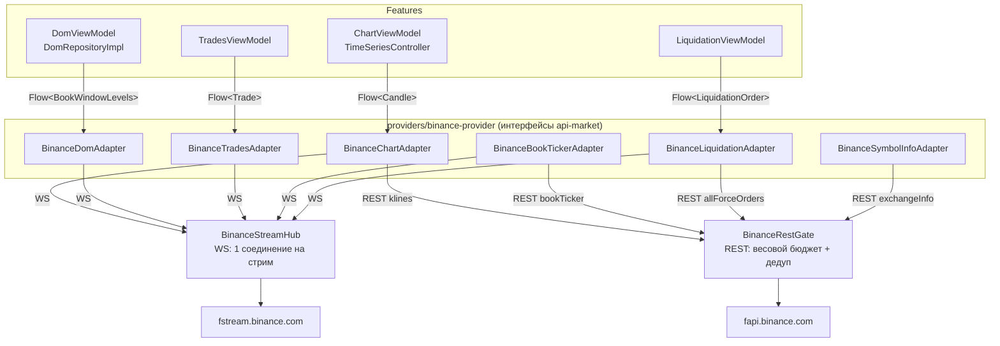
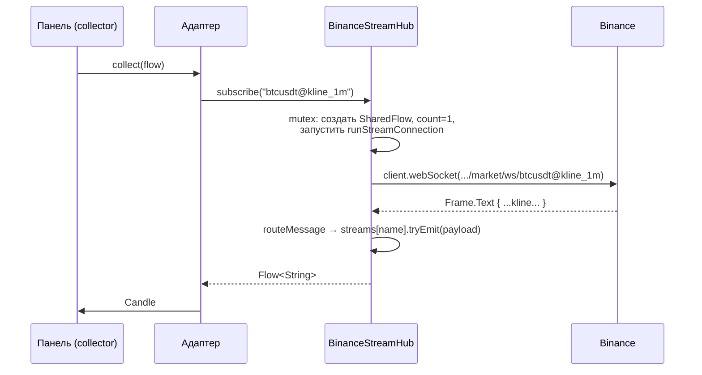
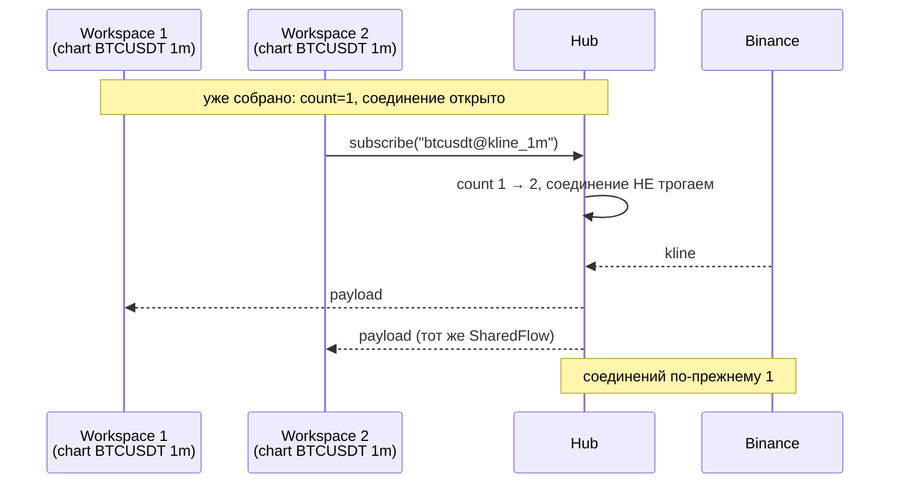
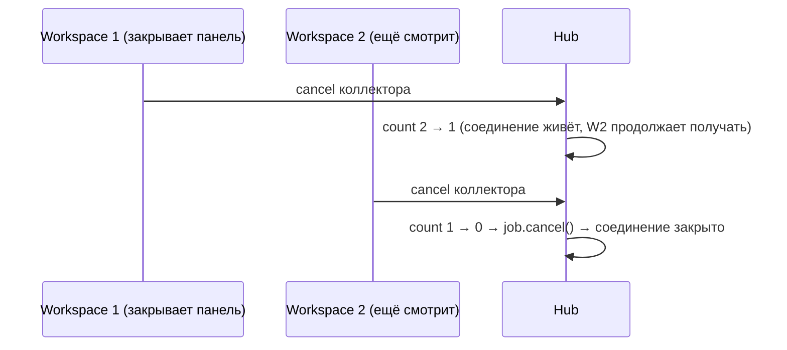
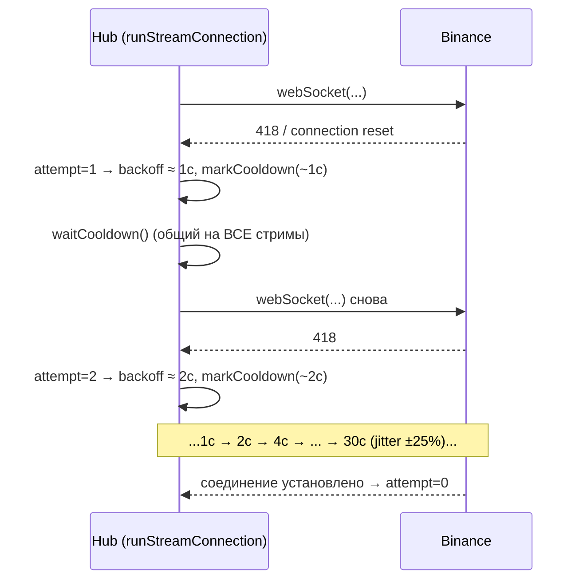

# Binance StreamHub: как работает WS-хаб и rate-limit защита

Дата: 2026-10-04. Статус: актуально для `providers/binance-provider`.

## 1. Зачем это всё

Раньше **каждый адаптер открывал собственное WebSocket-соединение** и сам
делал реконнекты. Workspace с 8 графиками и 12 DOM-панелями создавал 25+
подключений разом и ловил IP-бан Binance (418, «WebSocket connections are
limited», 300 попыток / 5 мин / IP → бан на ~30 000 мс). Аналогично REST:
несколько панелей одновременно слали одинаковые запросы (`klines`,
`exchangeInfo`, `bookTicker`), пробивая весовой лимит 2400 weight/min (429).

Решение — два общих компонента на провайдер:

| Компонент | Что делает |
|---|---|
| `BinanceStreamHub` | WS: одно соединение на уникальный стрим, refcounting подписчиков, общий cooldown/reconnect |
| `BinanceRestGate` | REST: весовой бюджет (минута), очередь, дедуп одинаковых запросов в полёте, ретраи при 418/429 |

> **Важно про combined streams.** У Binance есть мультиплексированный
> эндпоинт `wss://fstream.binance.com/stream?streams=a/b/c` (до 200 стримов
> на соединение). Мы пробовали его — и **на fstream он не отдаёт `kline_*`
> и `aggTrade`** (молчит или рвёт соединение), при этом `depth`/`bookTicker`
> работают. Это подтверждено live-тестом `StreamHubDiagnostics`. Поэтому хаб
> использует проверенные raw-эндпоинты: по одному соединению на стрим.

## 2. Куда подставлен хаб и какой у него интерфейс

### 2.1. Хаб НЕ заменяет адаптеры — он стоит ПОД ними

Адаптеры сохранили свои интерфейсы (`ChartAdapter`, `DomAdapter`,
`TradesAdapter`, `BookTickerAdapter`, `LiquidationAdapter` из
`public-api/api-market`). Хаб подставляется внутрь адаптеров через
конструктор — это нижний слой транспорта:



### 2.2. Один экземпляр на провайдер

`BinanceProvider` (single в Koin) создаёт хаб и гейт один раз и раздаёт их
всем адаптерам:

```kotlin
// BinanceProvider.kt
class BinanceProvider(...) : Provider {
    private val binanceHttpClient: HttpClient = BinanceHttpClientFactory.create()

    // Общие гейты: один на провайдер — все адаптеры ходят через них,
    // чтобы не пробивать rate limit Binance при открытии workspace с N панелями.
    private val restGate: BinanceRestGate = BinanceRestGate()
    private val streamHub: BinanceStreamHub = BinanceStreamHub(binanceHttpClient, config)

    override val trades by lazy { BinanceTradesAdapter(binanceHttpClient, config, streamHub) }
    override val dom by lazy { BinanceDomAdapter(binanceHttpClient, config, streamHub) }
    override val bookTicker by lazy { BinanceBookTickerAdapter(binanceHttpClient, config, restGate, streamHub) }
    override val chart by lazy { BinanceChartAdapter(binanceHttpClient, config, restGate, streamHub) }
    override val symbolInfo by lazy { BinanceSymbolInfoAdapter(binanceHttpClient, config, restGate) }
    override val liquidation by lazy { BinanceLiquidationAdapter(binanceHttpClient, config, restGate, streamHub) }
}
```

### 2.3. Интерфейс хаба — НЕ совпадает с интерфейсом адаптеров

Хаб — это строка-в-строку-наружу, без знания моделей:

```kotlin
fun subscribe(streamName: String): Flow<String>   // сырой payload сообщения
```

Имена стримов — строки Binance: `btcusdt@kline_1m`, `btcusdt@aggTrade`,
`btcusdt@depth10@100ms`, `btcusdt@bookTicker`, `btcusdt@forceOrder`.

Адаптер строит имя стрима, подписывается на хаб и **сам парсит** payload
в свою модель — вот как это выглядит в адаптерах:

```kotlin
// BinanceChartAdapter.kt
override fun subscribeToCandles(symbol: String, interval: String): Flow<Candle> {
    val streamName = "${symbol.lowercase()}@kline_$interval"
    return streamHub.subscribe(streamName)
        .map { json.decodeFromString<BinanceWebSocketResponse>(it) }
        .mapNotNull { ws -> if (ws.eventType == "kline") ws.kline.toCandle() else null }
}

// BinanceTradesAdapter.kt
override fun subscribeToTrades(symbol: String): Flow<Trade> {
    val streamName = "${symbol.lowercase()}@aggTrade"
    return streamHub.subscribe(streamName).map { json.decodeFromString<BinanceAggTrade>(it).toTrade() }
}

// BinanceDomAdapter.kt
override suspend fun subscribeToBookWindow(symbol: String, depth: Int): Flow<BookWindowLevels> {
    val streamName = "${symbol.lowercase()}@depth${depth}@100ms"
    return streamHub.subscribe(streamName).map { json.decodeFromString<BBookWindow>(it).toBookWindowLevels() }
}
```

Это дало побочный эффект, ради которого всё затевалось: **две панели,
подписавшиеся на один и тот же стрим, получают одно соединение** — в том
числе глобальный `btcusdt@forceOrder`, который раньше дублировался на каждый
график (`LiquidationViewModel` создаётся per-panel).

## 3. Внутренности хаба

```kotlin
class BinanceStreamHub(
    private val client: HttpClient,
    private val config: ProviderConfig,
) {
    private val scope = CoroutineScope(SupervisorJob() + Dispatchers.Default)
    private val mutex = Mutex()   // единый замок на все реестры (KMP: без synchronized)

    // streamName -> поток с сырым payload'ом сообщения
    private val streams = mutableMapOf<String, MutableSharedFlow<String>>()
    // streamName -> сколько подписчиков собирает поток
    private val subscriberCounts = mutableMapOf<String, Int>()
    // streamName -> Job соединения (живёт, пока есть хоть один подписчик)
    private val connectionJobs = mutableMapOf<String, Job>()

    @Volatile private var activeConnectionCount = 0  // для диагностики
    @Volatile private var activeStreamCount = 0      // для диагностики
    @Volatile private var cooldownUntil = 0L         // глобальный запрет подключений до...
}
```

Поток на стрим — это `MutableSharedFlow`:

```kotlin
MutableSharedFlow(extraBufferCapacity = 64, onBufferOverflow = BufferOverflow.DROP_OLDEST)
```

- **hot**: эмиты не теряются, даже если коллектор подключается чуть позже
  (буфер 64);
- **DROP_OLDEST**: на быстрых стримах (`aggTrade`, `bookTicker`) отстающий
  потребитель получает свежие данные, а не копит очередь.

`Mutex` вместо `synchronized` — потому что модуль компилируется в commonMain
(JVM + JS/wasm: хаб используется и bidasker-web).

## 4. Жизненный цикл: как ведёт себя хаб

### 4.1. Первая подписка на стрим



Что в коде:

```kotlin
fun subscribe(streamName: String): Flow<String> = flow {
    val shared = mutex.withLock {
        val f = streams.getOrPut(streamName) {
            MutableSharedFlow(extraBufferCapacity = 64, onBufferOverflow = BufferOverflow.DROP_OLDEST)
        }
        subscriberCounts[streamName] = (subscriberCounts[streamName] ?: 0) + 1
        if (subscriberCounts[streamName] == 1) {          // первый подписчик
            connectionJobs[streamName] = scope.launch { runStreamConnection(streamName) }
            activeConnectionCount = connectionJobs.size
        }
        activeStreamCount = streams.size
        f
    }
    try {
        shared.collect { emit(it) }                        // раздача всем подписчикам
    } finally {
        // отписка — см. 4.4
    }
}
```

Цикл соединения — одна корутина на стрим:

```kotlin
private suspend fun runStreamConnection(streamName: String) {
    val endpoint = if (config.isTestnet) {
        "wss://testnet.binance.vision/ws/$streamName"
    } else {
        // Проверенный формат: depth/bookTicker — /ws, остальные — /market/ws
        if (streamName.contains("@bookTicker") || streamName.contains("@depth")) {
            "wss://fstream.binance.com/ws/$streamName"
        } else {
            "wss://fstream.binance.com/market/ws/$streamName"
        }
    }

    var attempt = 0
    while (coroutineContext.isActive) {
        val stillSubscribed = mutex.withLock { connectionJobs[streamName] != null }
        if (!stillSubscribed) return                  // все отписались — выходим
        try {
            waitCooldown()
            client.webSocket(urlString = endpoint) {
                attempt = 0                            // успешный коннект сбрасывает backoff
                for (frame in incoming) {
                    if (frame is Frame.Text) routeMessage(streamName, frame.readText())
                }
            }
        } catch (e: CancellationException) { throw e }
        catch (e: Exception) { /* лог */ }

        attempt++
        val backoff = (1_000L shl (attempt - 1).coerceAtMost(5))   // 1с,2с,4с...30с
            .coerceAtMost(MAX_BACKOFF_MS)
            .let { it + Random.nextLong(0, it / 4 + 1) }           // jitter ±25%
        markCooldown(backoff.coerceAtLeast(DEFAULT_COOLDOWN_MS / 3))
    }
}
```

`routeMessage` — единственная точка раздачи:

```kotlin
private suspend fun routeMessage(streamName: String, text: String) {
    mutex.withLock { streams[streamName]?.tryEmit(text) }
}
```

### 4.2. Открываешь второй workspace — НОВОГО соединения НЕ будет

Ключевой сценарий. Workspace 2 создаёт новый `ChartViewModel` (per-panel),
который подписывается на **тот же** `btcusdt@kline_1m`. Хаб просто
увеличивает счётчик:



Экономия на примере «DOM Grid» (12 панелей DOM на 12 символах): 12 × 2 стрима
(depth + bookTicker) = 24 стрима, но если часть панелей на одном символе —
соединений ровно столько, сколько уникальных стримов, а не панелей.
Плюс `!forceOrder` (ликвидации): N графиков = 1 стрим = 1 соединение.

### 4.3. Хаб при реконнекте не рвёт потоки подписчиков

`runStreamConnection` пересоздаёт ТОЛЬКО WebSocket внутри цикла. Поток
`SharedFlow` живёт всё время, пока есть подписчик, — панель не узнает о
реконнекте. Поэтому циклы реконнекта в `DomRepositoryImpl`/`TradesViewModel`
(`.catch { ... }` + retry) больше не стреляют по-своему: их поток просто
не завершается.

### 4.4. Отписка (закрыли панель / сменили символ / закрыли workspace)

Коллектор отменяется → срабатывает `finally` → счётчик вниз; на нуле
соединение гасится и всё вычищается:



```kotlin
        } finally {
            val remaining = mutex.withLock {
                val count = (subscriberCounts[streamName] ?: 1) - 1
                if (count <= 0) {
                    subscriberCounts.remove(streamName)
                    streams.remove(streamName)
                    0
                } else {
                    subscriberCounts[streamName] = count
                    count
                }
            }
            mutex.withLock {
                if (remaining == 0) {
                    connectionJobs.remove(streamName)?.cancel()   // гасим соединение
                }
                activeStreamCount = streams.size
                activeConnectionCount = connectionJobs.size
            }
        }
```

### 4.5. Падение соединения / бан 418/429



Cooldown — **глобальный на хаб** (`cooldownUntil`): если один стрим поймал
бан, новые подключения остальных стримов ждут ту же паузу. Это осознанный
trade-off: банит Binance обычно по IP, поэтому штурмовать другими стримами
бессмысленно. `markCooldown` не укорачивает уже установленную паузу:

```kotlin
private suspend fun markCooldown(ms: Long) {
    val target = currentTimeMillis() + ms
    mutex.withLock { if (target > cooldownUntil) cooldownUntil = target }
}

private suspend fun waitCooldown() {
    while (true) {
        val remaining = cooldownUntil - currentTimeMillis()
        if (remaining <= 0) return
        delay(remaining.coerceAtLeast(50))
    }
}
```

## 5. BinanceRestGate (коротко)

Всё REST у Binance-адаптеров идёт через `restGate.execute(key, weight) { ... }`:

```kotlin
// BinanceChartAdapter.kt — пример использования гейта
override suspend fun getCandles(symbol: String, interval: String, limit: Int): List<Candle> =
    restGate.execute(
        key = "klines:$symbol:$interval:$limit",        // ключ дедупа
        weight = if (limit > 499) 2 else 1,            // вес по докам Binance
    ) {
        client.get("https://fapi.binance.com/fapi/v1/klines") { ... }.body()
    }
```

Внутри:

```mermaid
graph TD
    E[execute key, weight]
    E -->|key уже в полёте| JOIN[await существующего Deferred<br/>(дедуп)]
    E -->|новый ключ| ACQ[acquire weight:<br/>минутный токен-бакет 2000 w/min]
    ACQ --> RUN[block()]
    RUN -->|ok| DONE[complete Deferred, вернуть результат]
    RUN -->|418/429| CD[markCooldown Retry-After<br/>дефолт 30с]
    CD -->|attempt &lt; 3| ACQ
    CD -->|attempt = 3| FAIL[IllegalStateException]
```

- **Токен-бакет**: `available` пополняется пропорционально прошедшему
  времени; не хватает весов — запрос ждёт (очередь через `Mutex`).
- **Дедуп**: `inFlight[key] -> CompletableDeferred` — 8 панелей, одновременно
  запросившие одинаковые klines, сделают ОДИН HTTP-запрос.
- **418/429**: читается заголовок `Retry-After`; весь гейт засыпает, запрос
  ретраится изнутри (до 3 попыток).

## 6. Кэш exchangeInfo (защита от весового спама)

`BinanceSymbolInfoAdapter.getAllSymbolsInfo()` кэшируется в памяти на 10 мин:

```kotlin
@Volatile private var cachedAll: List<SymbolInfo>? = null
@Volatile private var cachedAt = 0L

private suspend fun allSymbols(): List<SymbolInfo> {
    cachedAll?.let { cached ->
        if (currentTimeMillis() - cachedAt < CACHE_TTL_MS) return cached
    }
    val fetched = restGate.execute(key = "exchangeInfo", weight = 1) { ... }
    cachedAll = fetched
    cachedAt = currentTimeMillis()
    return fetched
}
```

Раньше каждый `ChartViewModel` (per-panel) в `init` дёргал
`getAllSymbolsInfo()` — 8 графиков = 8 exchangeInfo. Теперь — 1 на процесс.

## 7. Диагностика

В логах хаба:

```
🔗 StreamHub: стрим btcusdt@kline_1m упал: <причина>
```

В коде — счётчики:

```kotlin
hub.connectionCount  // сколько сейчас активных WS-соединений
hub.streamCount       // сколько активных стримов
```

Live-тест `providers/binance-provider/src/jvmTest/.../StreamHubDiagnostics.kt`
проверяет реальную доставку kline / aggTrade / depth / bookTicker / forceOrder
через хаб (нужен доступ к fstream.binance.com).

## 8. Итого: что дала замена

| Было | Стало |
|---|---|
| 1 соединение на подписку (панель × стрим) | 1 соединение на уникальный стрим (дедуп по имени) |
| N графиков → N дублей `!forceOrder` | 1 стрим `!forceOrder` на все графики |
| Каждый адаптер сам ретраил (шторм при бане) | Общий cooldown + per-stream backoff, потоки подписчиков не рвутся |
| N × exchangeInfo, klines без дедупа | Кэш exchangeInfo 10 мин, дедуп in-flight, весовой бюджет |
| Бан 418 на 30 с при открытии DOM Grid | Не воспроизводится |

## 9. Ограничения и что дальше

- **Нет combined streams** — Binance-эндпоинт нестабилен для kline/aggTrade
  (см. §1). Если Binance починит/изменит поведение, хаб можно снова
  перевести на мультиплексирование, не трогая адаптеры: `subscribe()` и
  `runStreamConnection()` — единственное, что меняется.
- **Глобальный cooldown** — один стрим в бане тормозит подключения всех
  (осознанно, бан-то по IP). Можно развести cooldown на «мягкий» (ошибка
  сети) и «жёсткий» (418/429), если понадобится.
- **Буфер 64 / DROP_OLDEST** — на сверхбыстрых стримах часть сообщений
  теряется по дизайну; для стакана это неважно (там нужна свежесть),
  для сделок — приемлемо (лента).
- `activeConnectionCount`/`streamCount` — только для логов; UI-панель
  «Network» с этими метриками — кандидат на следующий этап.
