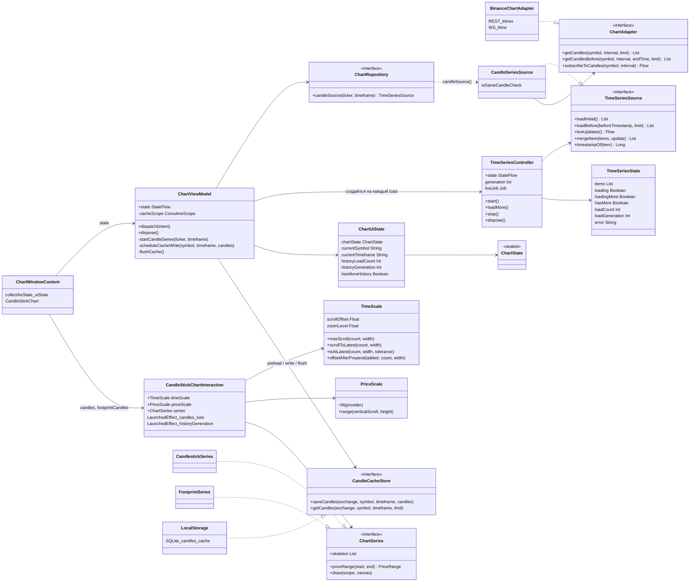
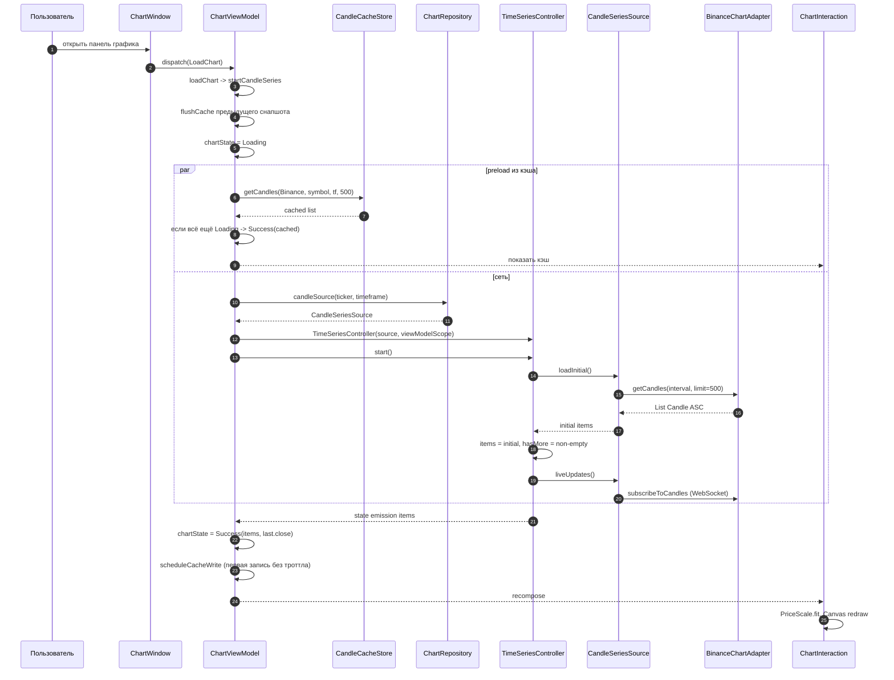
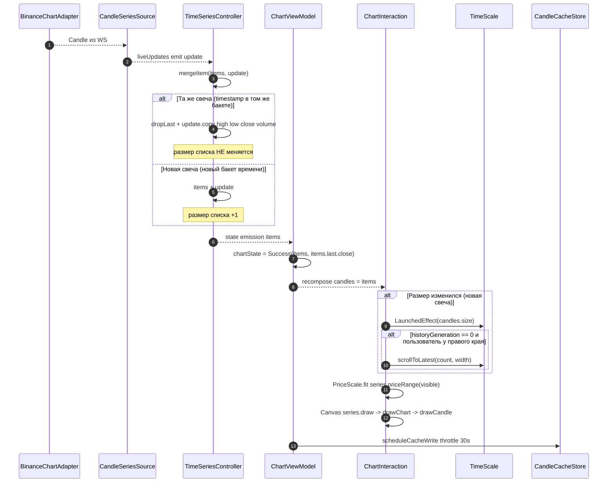
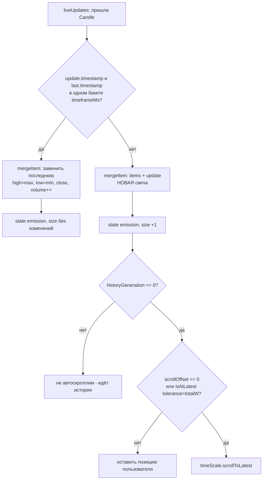
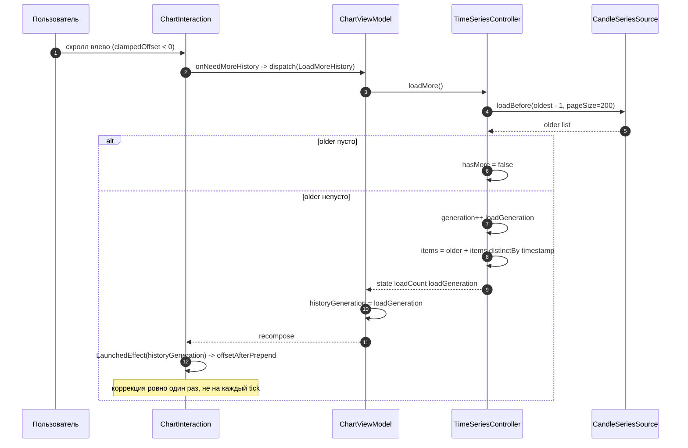
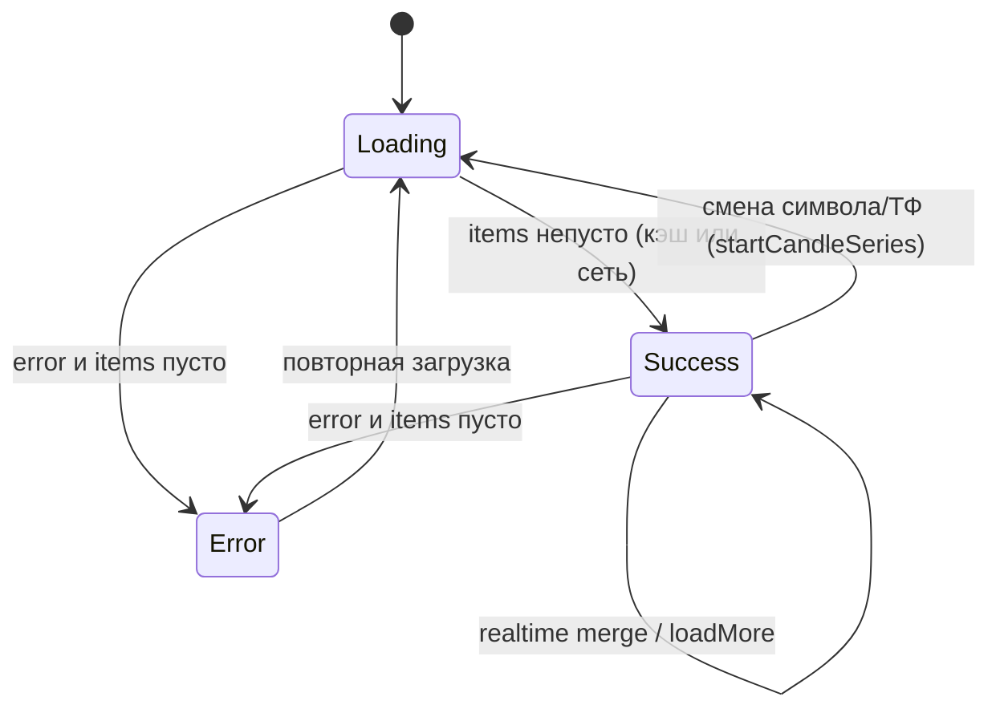
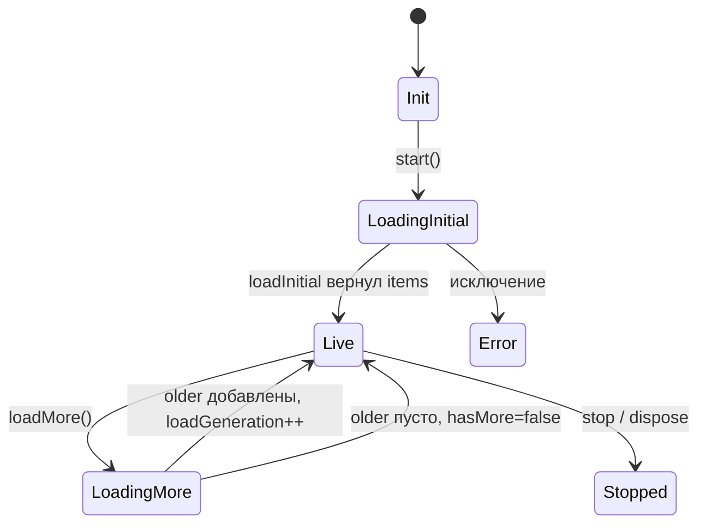
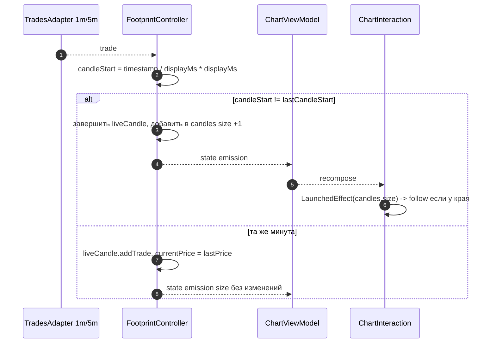

# Появление свечи на графике: сущности и последовательности

> Диаграммы Mermaid по коду ветки `chart-big-refactoring`.
> Отвечает на вопрос «как и где появляется/обновляется свеча» — от WebSocket
> Binance до отрисовки и кэша. Файлы и ключевые функции указаны рядом.

---

## 1. Сущности (кто участвует)

`TimeSeriesSource<T>`, `TimeSeriesController<T>`, `TimeSeriesState<T>` —
generic'и; на диаграмме параметр типа опущен для читаемости.

---

## 2. Общий поток: от биржи до пикселя

```mermaid
flowchart LR
    WS["Binance WS kline_1m"] --> AD["BinanceChartAdapter.subscribeToCandles"]
    REST["Binance REST klines"] --> AD2["BinanceChartAdapter.getCandles/getCandlesBefore"]
    AD --> SRC["CandleSeriesSource.liveUpdates"]
    AD2 --> SRC2["CandleSeriesSource.loadInitial/loadBefore"]
    SRC --> CTRL["TimeSeriesController liveJob"]
    SRC2 --> CTRL
    CTRL -->|"mergeItem"| ST["TimeSeriesState.items"]
    ST --> VM["ChartViewModel collector"]
    VM --> UI["ChartUiState.chartState Success"]
    UI --> WC["ChartWindowContent recompose"]
    WC --> ENG["CandleStickChartInteraction"]
    ENG -->|"series.draw"| DRAW["drawChart / drawCandle"]
    VM -.->|"throttled 30s"| CACHE["CandleCacheStore LocalStorage"]
    CACHE -.->|"preload при открытии"| VM
```

---

## 3. Последовательность: холодный старт (история + кэш)

---

## 4. Последовательность: новая realtime-свеча (главный кейс)

Ключевые места:

- решение «новая свеча или обновление последней» — `CandleSeriesSource.mergeItem`,
  ветка `isSameCandle` (`CandleSeriesSource.kt:35-52`);
- публикация состояния — `TimeSeriesController.start` (`TimeSeries.kt:82-83`);
- маппинг в `ChartState.Success` — `ChartViewModel.startCandleSeries`
  (`ChartViewModel.kt:266-282`);
- хук на изменение размера — `ChartInteraction.kt:409-418`;
- запись в кэш — `ChartViewModel.scheduleCacheWrite` (`ChartViewModel.kt:290-305`).

---

## 5. Решения: merge и автоскролл

---

## 6. Последовательность: подгрузка истории (loadMore)

Плюс автозаполнение вьюпорта: если `maxScroll == 0` и `hasMoreHistory`,
движок сам вызывает `onNeedMoreHistory` (`ChartInteraction.kt:420-428`).

---

## 7. Жизненный цикл состояний

`ChartState` (то, что видит UI):

`TimeSeriesState` (что поставляет контроллер):

---

## 8. Для сравнения: footprint (новый бакет)

Для 15m+ вместо лент сделок — `updateFormingCandle` (текущий бакет в `liveCandle`)
и polling закрытых бакетов (`FootprintController.start`).

---

## 9. Кто за что отвечает

| Шаг | Ответственный | Файл |
|---|---|---|
| WebSocket-свечи | `BinanceChartAdapter` | `providers/binance-provider/.../adapter/BinanceChartAdapter.kt` |
| HTTP-история кэндлов | `BinanceChartAdapter.getCandles/getCandlesBefore` | там же |
| Слияние realtime/истории | `CandleSeriesSource.mergeItem` | `platform-core/.../data/timeseries/CandleSeriesSource.kt:35` |
| Пагинация и состояние ряда | `TimeSeriesController` | `platform-core/.../domain/timeseries/TimeSeries.kt:68-123` |
| Маппинг в UI-состояние | `ChartViewModel.startCandleSeries` | `features/chart/.../ui/ChartViewModel.kt:226-283` |
| Кэш (запись/чтение/flush) | `ChartViewModel` + `LocalStorage` | `ChartViewModel.kt:290-320`, `features/localstorage/.../LocalStorage.kt` |
| Единый движок | `CandleStickChartInteraction` | `features/chart/.../ui/chart/ChartInteraction.kt` |
| Скролл/зум | `TimeScale` | `features/chart/.../scale/TimeScale.kt` |
| Autoscale диапазона | `PriceScale` + `ChartSeries.priceRange` | `scale/PriceScale.kt`, `ui/chart/ChartSeries.kt` |
| Отрисовка свечи | `drawChart` -> `drawCandle` | `features/chart/.../rendering/CandleRenderer.kt` |

---

## 10. Важные инварианты

- **Свеча появляется в `items` только через `mergeItem`**: тот же бакет →
  замена последней, новый бакет → `items + update`.
- **`candles.size` растёт** ровно в двух случаях: новая realtime-свеча и
  подгрузка истории. Движок различает их по `historyGeneration`.
- **Коррекция скролла** после истории применяется один раз на
  `loadGeneration` (иначе график «дёргался» на каждом тике).
- **Автоскролл** следует за ценой только если пользователь у правого края
  (`isAtLatest(tolerance = totalW)`) или это первичная загрузка.
- **Кэш пишется** throttled (30 c) + принудительно при смене символа/ТФ и
  `dispose`; читается на открытии (preload только при `ChartState.Loading`).
