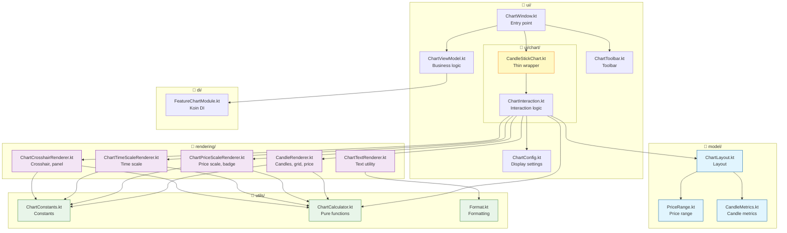

# Technical Book of the `feature-chart` Module

## Building an Exchange Chart with Kotlin + Compose Multiplatform

**Level:** Junior → Middle  
**Technologies:** Kotlin, Compose Multiplatform, Koin DI, Canvas 2D, Ktor  
**Product version:** Nous Platform 1.0  
**Author:** The Nous Team

---

# Table of Contents

1. [Introduction: What Is feature-chart](#1-introduction-what-is-feature-chart)
2. [KMP Module Architecture](#2-kmp-module-architecture)
3. [Entry Point: ChartWindow and main()](#3-entry-point-chartwindow-and-main)
4. [Dependency Injection: How Koin Builds the Application](#4-dependency-injection-how-koin-builds-the-application)
5. [ViewModel: State Management](#5-viewmodel-state-management)
6. [Sealed Interface ChartState](#6-sealed-interface-chartstate)
7. [CandleStickChart: The Heart of the Chart](#7-candlestickchart-the-heart-of-the-chart)
8. [Coordinate System and Layout (ChartLayout)](#8-coordinate-system-and-layout-chartlayout)
9. [Canvas Rendering: How Candles Are Drawn](#9-canvas-rendering-how-candles-are-drawn)
10. [Grid and Price Scale](#10-grid-and-price-scale)
11. [Time Scale](#11-time-scale)
12. [Scroll System (Panning)](#12-scroll-system-panning)
13. [Zoom System](#13-zoom-system)
14. [Dynamic PriceRange](#14-dynamic-pricerange)
15. [Crosshair: Cursor Lines and Info Panel](#15-crosshair-cursor-lines-and-info-panel)
16. [Lazy Loading of History](#16-lazy-loading-of-history)
17. [ChartToolbar: Control Panel](#17-charttoolbar-control-panel)
18. [ChartConfig and CandleStyle: Appearance Settings](#18-chartconfig-and-candlestyle-appearance-settings)
19. [Formatting Utilities](#19-formatting-utilities)
20. [Data Path: From API to Screen](#20-data-path-from-api-to-screen)
21. [Conclusion: How It All Works Together](#21-conclusion-how-it-all-works-together)
22. [Appendix: Glossary](#22-appendix-glossary)

---

# 1. Introduction: What Is feature-chart

## 1.1. Project Context

`feature-chart` is an exchange chart module (Japanese candlesticks) that is part of the **Nous Platform**. The platform is a cryptocurrency trading terminal written in **Kotlin Multiplatform (KMP)** using **Compose Multiplatform** for the UI.

The `feature-chart` module is a **standalone feature module**. This means it can run both as a separate application (via `./gradlew :features:feature-chart:run`) and as part of the main `composeApp` application.

## 1.2. What Does This Module Do?

The module displays the price movement as a **Japanese candlestick chart (Candlestick chart)**. The user can:

- View historical data (candles for different periods)
- Zoom with the mouse wheel (in and out)
- Pan the chart (drag it with the mouse)
- Enable the crosshair to pinpoint the price at a specific point
- Switch trading pairs (BTCUSDT, ETHUSDT, and others)
- Change timeframes (1m, 5m, 15m, 30m, 1h, 4h, 1d, 1w)
- Automatically load history when scrolling left

## 1.3. Technology Stack

| Technology | Purpose |
|---|---|
| Kotlin 2.3.0 | Programming language |
| Compose Multiplatform 1.7.0 | UI framework |
| Compose Canvas 2D | Rendering candles, grid, and scales |
| Koin 3.5.6 | Dependency injection |
| Ktor 3.4.1 | HTTP client for the API |
| kotlinx.coroutines | Asynchrony |
| kotlinx.serialization | JSON serialization |

## 1.4. Module File Structure

The module is organized according to **SRP (Single Responsibility Principle)**, **GRASP (Low Coupling / High Cohesion)**, and **Clean Architecture**. Instead of a single monolithic `CandleStickChartWidget.kt` file (1164 lines), the code is split into **13 files across 4 packages**:

```
features/feature-chart/
├── build.gradle.kts              # Build configuration
└── src/
    └── commonMain/
        └── kotlin/
            └── com/aandios/nous/feature/chart/
                ├── di/
                │   └── FeatureChartModule.kt       # Koin DI module
                ├── model/                          # Data models (SRP: Pure Fabrication)
                │   ├── PriceRange.kt               # Price range max/min/visible
                │   ├── CandleMetrics.kt            # Candle metrics (width, spacing)
                │   └── ChartLayout.kt              # Layout of chart areas
                ├── rendering/                      # Canvas rendering functions (SRP: Protected Variations)
                │   ├── CandleRenderer.kt           # Candles, grid, price line
                │   ├── ChartPriceScaleRenderer.kt  # Price scale and badge
                │   ├── ChartTimeScaleRenderer.kt   # Time scale
                │   ├── ChartCrosshairRenderer.kt   # Crosshair and info panel
                │   └── ChartTextRenderer.kt        # Text utility
                ├── ui/
                │   ├── chart/
                │   │   ├── CandleStickChart.kt     # Thin wrapper (20 lines, only @Composable)
                │   │   └── ChartInteraction.kt     # All interaction logic (~14KB)
                │   ├── ChartWindow.kt              # Entry point for standalone launch
                │   ├── ChartViewModel.kt           # ViewModel with business logic
                │   ├── ChartToolbar.kt             # Toolbar
                │   └── ChartConfig.kt              # Rendering configuration
                └── utils/
                    ├── ChartConstants.kt           # Constants (BASE_CANDLE_WIDTH)
                    ├── ChartCalculator.kt          # Pure calculation functions (6 total)
                    └── Format.kt                   # Price and time formatting
```

**Key changes:**
- `model/` — data classes with no logic (PriceRange, CandleMetrics, ChartLayout)
- `rendering/` — all `fun DrawScope.*` extension functions, each in its own file
- `ui/chart/CandleStickChart.kt` — a thin wrapper (delegates to `CandleStickChartInteraction`)
- `ui/chart/ChartInteraction.kt` — all the complex interaction logic, layout, and Canvas
- `utils/ChartCalculator.kt` — pure functions (calculateCandleMetrics, priceToY, and others)
- The old `CandleStickChartWidget.kt` has been removed

## 1.5. Architecture Diagram




# 2. KMP Module Architecture

## 2.1. build.gradle.kts: How the Module Is Built

```kotlin
// features/feature-chart/build.gradle.kts
plugins {
    id("conventions.kmp-feature")     // Standard convention plugin for feature modules
    alias(libs.plugins.kotlin.serialization)  // JSON serialization plugin
}

kotlin {
    sourceSets {
        commonMain.dependencies {
            implementation(project(":platform-core"))       // Core module
            implementation(project(":public-api:api-market")) // Market data API
            implementation(project(":providers:binance-provider")) // Binance provider

            implementation(libs.koin.core)                  // DI
            implementation(libs.koin.compose)               // Koin integration with Compose
            implementation(libs.kotlinx.coroutines.core)    // Coroutines
            implementation(libs.kotlinx.serialization.json) // JSON
            implementation(libs.compose.material3)          // Material 3 UI
        }

        jvmMain.dependencies {
            implementation(compose.desktop.currentOs)       // Desktop-specific Compose
            implementation(libs.kotlinx.coroutines.swing)   // Swing dispatcher
        }

        commonTest.dependencies {
            implementation(libs.kotlin.test)
            implementation(libs.junit.jupiter)
            implementation(libs.kotlinx.coroutines.test)
            implementation(libs.ktor.client.mock)           // Mock for Ktor
        }
    }
}

compose.desktop {
    application {
        mainClass = "com.aandios.nous.feature.chart.ui.ChartWindowKt"
    }
}
```

### 2.1.1. The `conventions.kmp-feature` Plugin

This custom plugin from `build-logic` automatically applies:

```kotlin
// build-logic/src/main/kotlin/conventions/KmpFeatureConvention.kt
apply("org.jetbrains.kotlin.multiplatform")   // KMP
apply("org.jetbrains.compose")                // Compose Multiplatform
apply("org.jetbrains.kotlin.plugin.compose")  // Compose compiler plugin
```

It also adds the base Compose dependencies:
```kotlin
commonMain.dependencies {
    api(project(":core:core-dependencies"))     // Base transitive dependencies
    implementation(libs.findLibrary("compose.runtime").get())
    implementation(libs.findLibrary("compose.foundation").get())
    implementation(libs.findLibrary("compose.material3").get())
    implementation(libs.findLibrary("compose.ui").get())
}
```

### 2.1.2. The `compose.desktop.application` Block

This block is **critically important** — it turns the KMP module into a runnable desktop application:

```kotlin
compose.desktop {
    application {
        mainClass = "com.aandios.nous.feature.chart.ui.ChartWindowKt"
    }
}
```

Thanks to this, you can run:
```bash
./gradlew :features:feature-chart:run
```

**For Junior**: `mainClass` points to the file that contains `fun main()` — the entry point. The file is named `ChartWindow.kt`, so in Kotlin/JVM the class file is called `ChartWindowKt` (the `Kt` is appended automatically).

## 2.2. Key Features of the KMP Architecture

The module uses **Kotlin Multiplatform (KMP)**, although at the moment there is only one target platform — **JVM (Desktop)**. This is done with the future in mind — in theory the module could be built for Android, iOS, and Web.

**Source sets**:
- `commonMain` — code shared by all platforms (including the UI)
- `jvmMain` — JVM-specific code (Desktop Compose and Swing dependencies)
- `commonTest` — tests

---

# 3. Entry Point: ChartWindow and main()

## 3.1. The ChartWindow.kt File

This file contains two key things:

1. **`fun main()`** — the application entry point
2. **`@Composable fun ChartWindow()`** — the root composable component

## 3.2. The main() Function

```kotlin
fun main() = application {
    stopKoin()
    initKoinForPreview()

    Window(
        onCloseRequest = ::exitApplication,
        title = "Nous Platform • Chart Preview",
        state = rememberWindowState(width = 800.dp, height = 600.dp)
    ) {
        KoinContext {
            TradingTerminalTheme {
                ChartWindow()
            }
        }
    }
}
```

### 3.2.1. `application { }` — the Compose Desktop entry point

This is the Compose for Desktop API, analogous to `Activity` in Android. The `application { }` block defines the lifecycle of a desktop application.

### 3.2.2. `stopKoin()` and `initKoinForPreview()`

Before launching the application we reinitialize Koin — the Dependency Injection (DI) system. We will examine it in detail in Chapter 4.

### 3.2.3. `Window(...)` — the system window

```kotlin
Window(
    onCloseRequest = ::exitApplication,     // On window close → exit the application
    title = "Nous Platform • Chart Preview", // Window title
    state = rememberWindowState(             // Window state
        width = 800.dp,
        height = 600.dp
    )
)
```

- `onCloseRequest` — callback invoked when the window closes (when the close button is clicked)
- `rememberWindowState` — preserves the window size and position across recompositions

### 3.2.4. Nested wrappers

```kotlin
KoinContext {               // Provides access to DI dependencies inside the Compose tree
    TradingTerminalTheme {  // UI theme (colors, typography)
        ChartWindow()       // Our root component
    }
}
```

## 3.3. The ChartWindow() Function

```kotlin
@Composable
fun ChartWindow() {
    val chartViewModel: ChartViewModel = koinInject()   // ← Get the ViewModel from DI
    val chartState by chartViewModel.chartState.collectAsState()  // ← Subscribe to the state
    // ... other states

    var crosshairEnabled by remember { mutableStateOf(false) }

    LaunchedEffect(Unit) {
        chartViewModel.loadChart()   // ← Load data on first render
    }

    Box(modifier = Modifier.fillMaxSize()) {
        when (val state = chartState) {
            is ChartState.Loading -> { /* loading spinner */ }
            is ChartState.Error -> { /* error message */ }
            is ChartState.Success -> {
                // Chart + toolbar
                CandleStickChart(...)
                ChartToolbar(...)
            }
        }
    }
}
```

### 3.3.1. `koinInject()` — the DI magic

`koinInject()` is a function from the `koin-compose` library. It automatically finds an object of the required type in the Koin container and returns it. Without it, we would have to manually create `ChartViewModel` with all of its dependencies.

### 3.3.2. `collectAsState()` — the bridge between coroutines and Compose

```kotlin
val chartState by chartViewModel.chartState.collectAsState()
```

`chartViewModel.chartState` is a `StateFlow<ChartState>`. `collectAsState()` subscribes to this flow and returns a `State<ChartState>`. Every time the flow emits a new value, Compose automatically redraws (recomposes) the UI.

**For Junior**: `StateFlow` is like a radio station that constantly broadcasts the news. `collectAsState()` is the radio receiver that catches this news and shows it on the screen. When the news changes, the screen updates.

### 3.3.3. `when (chartState)` — state-driven UI

The entire UI is built around one of three states:

```kotlin
sealed interface ChartState {
    object Loading : ChartState      // Loading
    data class Success(...) : ChartState  // Successful data
    data class Error(message: String) : ChartState  // Error
}
```

This is called **state-driven UI** — the interface always reflects the current state of the data. There is no "UI on its own".

---

# 4. Dependency Injection: How Koin Builds the Application

## 4.1. What Is Dependency Injection (DI)?

**Dependency Injection** is a pattern in which an object receives its dependencies from the outside instead of creating them itself.

Without DI:
```kotlin
class ChartViewModel {
    private val repo = ChartRepositoryImpl(ChartAdapter(...)) // Tight coupling
}
```

With DI:
```kotlin
class ChartViewModel(
    private val chartRepository: ChartRepository,  // Dependency is injected from outside
    private val symbolInfoAdapter: SymbolInfoAdapter
)
```

Koin is a DI framework that manages the creation of all objects.

## 4.2. The `featureChartModule` Module

```kotlin
val featureChartModule = module {
    // 1. Provider configuration
    single<ProviderConfig> {
        ProviderConfig(
            apiKey = null,
            secretKey = null,
            isTestnet = false,
            customSettings = emptyMap()
        )
    }

    // 2. Create the Provider directly through the factory
    single<Provider> {
        val config = get<ProviderConfig>()
        val networkManager = get<NetworkManager>()
        BinanceProviderFactory().createProvider(config, networkManager)
    }

    // 3. Chart adapter from the provider
    single<ChartAdapter> {
        get<Provider>().chart ?: error("Chart adapter not available")
    }

    // 4. Chart repository
    single<ChartRepository> {
        ChartRepositoryImpl(chartAdapter = get())
    }

    // 5. SymbolInfo adapter
    single<SymbolInfoAdapter> {
        get<Provider>().symbolInfo ?: error("SymbolInfo adapter not available")
    }

    // 6. ViewModel
    factory {
        ChartViewModel(
            chartRepository = get(),
            symbolInfoAdapter = get(),
        )
    }
}
```

### 4.2.1. `single { }` vs `factory { }`

- **`single { }`** — creates the object once and stores it in the container. Everyone who requests this type gets the same instance.
- **`factory { }`** — creates a new instance on every request. ViewModels are usually defined as factories so that each screen gets its own instance.

### 4.2.2. The dependency chain

```
Koin container
│
├── NetworkManager (from coreModule)
│
├── ProviderConfig → Provider (BinanceProviderFactory) → ChartAdapter + SymbolInfoAdapter
│                                                              │
│                                                              ▼
│                                              ChartRepositoryImpl
│                                                              │
│                                              ┌────────────────┘
│                                              ▼
│                                        ChartViewModel
│                                              │
│                                              ▼ (exposed to Compose via koinInject)
│                                        ChartWindow()
```

## 4.3. The `initKoinForPreview()` Function

```kotlin
fun initKoinForPreview() {
    stopKoin()                               // Stop the old Koin (if it exists)
    startKoin {
        modules(
            coreModule,                      // Base module (NetworkManager, HttpClient)
            featureChartModule,              // Chart feature module
        )
    }
}
```

This function creates an **isolated** Koin context for running ChartWindow standalone. It does not include the other feature modules, to avoid conflicts.

---

# 5. ViewModel: State Management

## 5.1. Constructor and Scope

```kotlin
class ChartViewModel(
    private val chartRepository: ChartRepository,
    private val symbolInfoAdapter: SymbolInfoAdapter,
) {
    private val viewModelScope = CoroutineScope(Dispatchers.Main + SupervisorJob())
    private var currentJob: Job? = null
    private var isLoadingMore = false
    // ...
}
```

### 5.1.1. `viewModelScope`

This is a custom CoroutineScope (not the Android-specific `viewModelScope` from lifecycle). It is created manually:

```kotlin
CoroutineScope(Dispatchers.Main + SupervisorJob())
```

- **`Dispatchers.Main`** — all coroutines run on the main (UI) thread
- **`SupervisorJob()`** — if one coroutine fails with an error, the others are not cancelled

### 5.1.2. `currentJob`

A reference to the currently running Job used for data loading. It lets us cancel the previous load if the user quickly switches the symbol or timeframe.

## 5.2. States (StateFlows)

```kotlin
private val _chartState = MutableStateFlow<ChartState>(ChartState.Loading)
val chartState: StateFlow<ChartState> = _chartState.asStateFlow()

private val _currentSymbol = MutableStateFlow("BTCUSDT")
val currentSymbol: StateFlow<String> = _currentSymbol.asStateFlow()

private val _currentTimeframe = MutableStateFlow("1h")
val currentTimeframe: StateFlow<String> = _currentTimeframe.asStateFlow()

private val _symbols = MutableStateFlow<List<String>>(listOf("BTCUSDT", "ETHUSDT"))

private val _historyLoadCount = MutableStateFlow(0)
val historyLoadCount: StateFlow<Int> = _historyLoadCount.asStateFlow()

private val _hasMoreHistory = MutableStateFlow(true)
val hasMoreHistory: StateFlow<Boolean> = _hasMoreHistory.asStateFlow()
```

### 5.2.1. Why do we need a backing property?

The pattern with `_chartState` (private mutable) and `chartState` (public read-only):

```kotlin
private val _chartState = MutableStateFlow<ChartState>(...)
val chartState: StateFlow<ChartState> = _chartState.asStateFlow()
```

**Why?** So that no one outside can change the state — only the ViewModel itself. This is **encapsulation**.

## 5.3. Loading Data: `loadChart()`

```kotlin
fun loadChart(ticker: String = "BTCUSDT", timeframe: String = "1h") {
    // 1. Reset history state
    _hasMoreHistory.value = true
    _historyLoadCount.value = 0
    isLoadingMore = false

    viewModelScope.launch {
        _chartState.value = ChartState.Loading  // Show the loading state

        delay(100)                              // Small delay
        currentJob?.cancel()                    // Cancel the previous load

        currentJob = launch {
            try {
                chartRepository.getChart(ticker, timeframe)
                    .catch { e ->
                        _chartState.value = ChartState.Error(e.message ?: "Unknown error")
                    }
                    .collect { candles ->
                        if (candles.isNotEmpty()) {
                            val lastPrice = candles.last().close
                            _chartState.value = ChartState.Success(
                                candles = candles,
                                currentPrice = lastPrice
                            )
                        }
                    }
            } catch (e: CancellationException) {
                // Proper cancellation — not an error
            } catch (e: Exception) {
                _chartState.value = ChartState.Error(e.message ?: "Unknown error")
            }
        }
    }
}
```

### 5.3.1. How `chartRepository.getChart()` works

It returns a `Flow<List<Candle>>`. This means the data can update in real time — whenever the prices change on the exchange, the flow can emit a new list of candles.

### 5.3.2. `CancellationException`

`CancellationException` is handled separately — it is thrown when a coroutine is cancelled (for example, when `currentJob?.cancel()` is called). It is **not an error**, so we simply ignore it.

## 5.4. Loading History: `loadMoreHistory()`

```kotlin
fun loadMoreHistory() {
    if (isLoadingMore || !_hasMoreHistory.value) return
    isLoadingMore = true

    viewModelScope.launch {
        val state = _chartState.value
        if (state !is ChartState.Success) {
            isLoadingMore = false
            return@launch
        }

        val oldestTime = state.candles.firstOrNull()?.timestamp ?: run {
            isLoadingMore = false
            return@launch
        }

        // Load candles BEFORE the oldest one
        val historicalCandles = chartRepository.loadHistoricalCandlesBefore(
            ticker = _currentSymbol.value,
            timeframe = _currentTimeframe.value,
            endTime = oldestTime - 1,
            limit = 200
        )

        if (historicalCandles.isEmpty()) {
            _hasMoreHistory.value = false
            isLoadingMore = false
            return@launch
        }

        // Prepend historical candles (add to the beginning)
        val newCandles = historicalCandles + state.candles

        // Cancel the real-time flow so it does not overwrite our data
        currentJob?.cancel()

        _chartState.value = ChartState.Success(
            candles = newCandles,
            currentPrice = newCandles.last().close
        )
        _historyLoadCount.value = historicalCandles.size
        isLoadingMore = false
    }
}
```

Lazy loading is covered in detail in Chapter 16.

---

# 6. Sealed Interface ChartState

## 6.1. What Is a sealed interface?

```kotlin
sealed interface ChartState {
    object Loading : ChartState
    data class Success(
        val candles: List<Candle>,
        val currentPrice: Float? = null
    ) : ChartState
    data class Error(val message: String) : ChartState
}
```

**Sealed interface** is an interface with a restricted set of implementations. The compiler knows all possible variants, which gives us:

1. **An exhaustive `when`** — Kotlin requires all variants to be handled
2. **New implementations cannot be created outside the file**

## 6.2. Why sealed interface and not sealed class?

`sealed interface` appeared in Kotlin 1.5 and is more convenient when the implementations are data classes (a data class cannot inherit from a sealed class, but it can from a sealed interface).

## 6.3. How It Is Used in the UI

```kotlin
when (val state = chartState) {
    is ChartState.Loading -> { /* Spinner */ }
    is ChartState.Error -> { /* Message */ }
    is ChartState.Success -> { /* Chart */ }
}
// No else needed — all variants are handled!
```

**For Junior**: Kotlin guarantees that you will not forget to handle a state. If you add a new state to the sealed interface, the compiler will point out every place where it must be handled.

---

# 7. CandleStickChart: The Heart of the Chart

After the refactoring, the old monolithic `CandleStickChartWidget.kt` (1164 lines) is split into **two files** in the [`ui/chart/`](features/feature-chart/src/commonMain/kotlin/com/aandios/nous/feature/chart/ui/chart/) package:

1. [`CandleStickChart.kt`](features/feature-chart/src/commonMain/kotlin/com/aandios/nous/feature/chart/ui/chart/CandleStickChart.kt) — a **thin wrapper** (~20 lines), only the `@Composable` signature
2. [`ChartInteraction.kt`](features/feature-chart/src/commonMain/kotlin/com/aandios/nous/feature/chart/ui/chart/ChartInteraction.kt) — **all the interactive logic** (~14KB): state, gestures, layout, Canvas

This split follows **SRP (Single Responsibility Principle)** and **GRASP Pure Fabrication** — `CandleStickChart` is responsible only for the public API, while `CandleStickChartInteraction` handles all the complexity of the interaction.

## 7.1. CandleStickChart — a Thin Wrapper

```kotlin
// features/feature-chart/src/commonMain/.../ui/chart/CandleStickChart.kt
@Composable
fun CandleStickChart(
    candles: List<Candle>,
    currentPrice: Float? = null,
    modifier: Modifier = Modifier,
    config: ChartConfig = DefaultChartConfig,
    showPriceScale: Boolean = true,
    priceScaleWidth: Dp = 60.dp,
    crosshairEnabled: Boolean = false,
    onCrosshairEnabledChange: (Boolean) -> Unit = {},
    onNeedMoreHistory: () -> Unit = {},
    historyLoadCount: Int = 0,
    hasMoreHistory: Boolean = true,
) {
    CandleStickChartInteraction(
        candles = candles,
        currentPrice = currentPrice,
        modifier = modifier,
        config = config,
        showPriceScale = showPriceScale,
        priceScaleWidth = priceScaleWidth,
        crosshairEnabled = crosshairEnabled,
        onCrosshairEnabledChange = onCrosshairEnabledChange,
        onNeedMoreHistory = onNeedMoreHistory,
        historyLoadCount = historyLoadCount,
        hasMoreHistory = hasMoreHistory,
    )
}
```

### Parameters:

| Parameter | Type | Default | Description |
|---|---|---|---|
| `candles` | `List<Candle>` | required | List of candles to display |
| `currentPrice` | `Float?` | `null` | Current price (line on the chart) |
| `modifier` | `Modifier` | `Modifier` | Compose modifier |
| `config` | `ChartConfig` | `DefaultChartConfig` | Rendering settings |
| `showPriceScale` | `Boolean` | `true` | Show the price scale |
| `priceScaleWidth` | `Dp` | `60.dp` | Width of the price scale |
| `crosshairEnabled` | `Boolean` | `false` | Enable the crosshair |
| `onCrosshairEnabledChange` | `(Boolean) -> Unit` | `{}` | Crosshair change callback |
| `onNeedMoreHistory` | `() -> Unit` | `{}` | Request to load history |
| `historyLoadCount` | `Int` | `0` | How many candles were loaded historically |
| `hasMoreHistory` | `Boolean` | `true` | Whether there is more history to load |

## 7.2. CandleStickChartInteraction — All the Logic

The [`ChartInteraction.kt`](features/feature-chart/src/commonMain/kotlin/com/aandios/nous/feature/chart/ui/chart/ChartInteraction.kt) file contains:

### 7.2.1. Internal state

```kotlin
if (candles.isEmpty()) return

var mousePosition by remember { mutableStateOf<Offset?>(null) }
var isCrosshairVisible by remember { mutableStateOf(false) }
var scrollOffset by remember { mutableFloatStateOf(0f) }
var zoomLevel by remember { mutableFloatStateOf(1f) }
var chartWidthPx by remember { mutableFloatStateOf(0f) }
var maxScroll by remember { mutableFloatStateOf(0f) }       // ← maxScroll as STATE
var isCtrlPressed by remember { mutableStateOf(false) }

val maxScrollLeft = 300f  // history load trigger
```

### 7.2.2. `mutableFloatStateOf` vs `mutableStateOf`

`mutableFloatStateOf` is an optimized version of `mutableStateOf` for `Float`. It avoids autoboxing `Float` into an object.

### 7.2.3. Composable structure

```kotlin
BoxWithConstraints(modifier = modifier
    .fillMaxSize()
    .clickable(                        // ← focusability for onKeyEvent
        interactionSource = remember { MutableInteractionSource() },
        indication = null
    ) { /* no-op */ }
    .onKeyEvent { event ->             // ← Ctrl key tracking
        if (event.key == Key.CtrlLeft || event.key == Key.CtrlRight) {
            isCtrlPressed = event.type == KeyEventType.KeyDown
            true
        } else false
    }
    .pointerInput(crosshairEnabled) { ... }  // ← Drag or Crosshair
    .pointerInput(Unit) { ... }              // ← Mouse wheel zoom
) {
    val layout = remember(...) { calculateLayout(...) }
    chartWidthPx = layout.chartMainArea.width

    val candleMetrics = remember(zoomLevel) { calculateCandleMetrics(zoomLevel) }
    maxScroll = max(0f, candles.size * totalW - chartWidthPx)  // ← update maxScroll

    // LaunchedEffect to control scrolling
    LaunchedEffect(...) { ... }

    // Main Canvas — delegates to the rendering/ package
    Canvas(modifier = Modifier.fillMaxSize().clipToBounds()) {
        drawChart(...)          // CandleRenderer.kt
        drawTimeScale(...)      // ChartTimeScaleRenderer.kt
        drawPriceScale(...)     // ChartPriceScaleRenderer.kt
        drawCrosshair(...)      // ChartCrosshairRenderer.kt
    }
}
```

**Key differences from the old structure:**
1. `maxScroll` is a `mutableFloatStateOf`, not a local `val`; it is updated inside `BoxWithConstraints`
2. `clickable(indication = null)` is required for focusability (without it, `onKeyEvent` does not fire)
3. All drawing functions are `DrawScope` extensions from the `rendering/` package (imported via `import com.aandios.nous.feature.chart.rendering.*`)

---

# 8. Coordinate System and Layout (ChartLayout)

The [`ChartLayout`](features/feature-chart/src/commonMain/kotlin/com/aandios/nous/feature/chart/model/ChartLayout.kt) model lives in the [`model/`](features/feature-chart/src/commonMain/kotlin/com/aandios/nous/feature/chart/model/) package together with the other data classes. It is a **Pure Fabrication** (GRASP) — an artificial entity with no counterpart in the problem domain that simplifies passing layout parameters between components.

## 8.1. ChartLayout structure

```kotlin
// features/feature-chart/src/commonMain/.../model/ChartLayout.kt
data class ChartLayout(
    val canvasWidth: Float,
    val canvasHeight: Float,
    val priceScaleWidth: Float,
    val chartArea: Rect,           // Entire chart area
    val priceScaleArea: Rect,      // Price scale area (right)
    val chartPadding: Float = 8f,
    val timeScaleHeight: Float = 20f,
    val chartMainArea: Rect,       // Candle area
    val timeScaleArea: Rect        // Time scale area (bottom)
)
```

## 8.2. Visual structure of the window

```
┌─────────────────────────────────────┬──────────────┐
│                                     │              │
│                                     │  Price       │
│          chartMainArea              │  Scale       │
│          (candles)                    │              │
│                                     │  1234.5      │
│                                     │              │
│                                     │              │
├─────────────────────────────────────┴──────────────┤
│                  timeScaleArea                      │
│    12:00    13:00    14:00    15:00    16:00       │
└────────────────────────────────────────────────────┘
```

## 8.3. Calculating the layout

```kotlin
val layout = remember(priceScaleWidth, canvasWidth, canvasHeight) {
    val widthPx = with(density) { canvasWidth.toPx() }
    val heightPx = with(density) { canvasHeight.toPx() }
    val chartPadding = 8f
    
    // Time scale height — 4% of the height, but no less than 20px and no more than 40px
    val timeScaleHeight = (heightPx * 0.04f).coerceAtLeast(20f).coerceAtMost(40f)
    
    val priceScaleWidthPx = with(density) { priceScaleWidth.toPx() }
    
    // Price scale — on the right
    val priceScaleArea = Rect(
        left = widthPx - priceScaleWidthPx,
        top = 0f,
        right = widthPx,
        bottom = heightPx
    )
    
    // Time scale — at the bottom
    val timeScaleArea = Rect(
        left = 0f,
        top = heightPx - timeScaleHeight,
        right = widthPx - priceScaleWidthPx - chartPadding,
        bottom = heightPx
    )
    
    // Main chart area (without the time scale)
    val chartMainArea = Rect(
        left = 0f,
        top = 0f,
        right = widthPx - priceScaleWidthPx - chartPadding,
        bottom = heightPx - timeScaleHeight
    )
    
    ChartLayout(...)
}
```

### 8.3.1. `remember(priceScaleWidth, canvasWidth, canvasHeight)`

The layout is recalculated only when the window size or the price scale setting changes. On scroll/zoom/data change, the layout is not recalculated.

### 8.3.2. Converting Dp to pixels

```kotlin
val widthPx = with(density) { canvasWidth.toPx() }
```

`BoxWithConstraints` provides sizes in `Dp` (logical units), but Canvas works in pixels. `LocalDensity.current` allows the conversion.

---

# 9. Canvas Rendering: How Candles Are Drawn

All drawing functions are extracted into a separate [`rendering/`](features/feature-chart/src/commonMain/kotlin/com/aandios/nous/feature/chart/rendering/) package as `fun DrawScope.*` extension functions. Each file is responsible for its own part of rendering (SRP):

| File | Responsibility |
|---|---|
| [`CandleRenderer.kt`](features/feature-chart/src/commonMain/kotlin/com/aandios/nous/feature/chart/rendering/CandleRenderer.kt) | Candles (`drawChart`, `drawCandle`), grid (`drawGrid`), price line (`drawCurrentPriceLine`) |
| [`ChartPriceScaleRenderer.kt`](features/feature-chart/src/commonMain/kotlin/com/aandios/nous/feature/chart/rendering/ChartPriceScaleRenderer.kt) | Price scale (`drawPriceScale`), badge (`drawCurrentPriceBadge`, `drawCurrentPriceLabel`), price level (`drawPriceLevel`) |
| [`ChartTimeScaleRenderer.kt`](features/feature-chart/src/commonMain/kotlin/com/aandios/nous/feature/chart/rendering/ChartTimeScaleRenderer.kt) | Time scale (`drawTimeScale`) |
| [`ChartCrosshairRenderer.kt`](features/feature-chart/src/commonMain/kotlin/com/aandios/nous/feature/chart/rendering/ChartCrosshairRenderer.kt) | Crosshair (`drawCrosshair`), info panel (`drawInfoPanel`), axis labels (`drawPriceLabelOnAxis`, `drawTimeLabelOnAxis`) |
| [`ChartTextRenderer.kt`](features/feature-chart/src/commonMain/kotlin/com/aandios/nous/feature/chart/rendering/ChartTextRenderer.kt) | Text utility (`drawTextLine`) |

Imports in [`ChartInteraction.kt`](features/feature-chart/src/commonMain/kotlin/com/aandios/nous/feature/chart/ui/chart/ChartInteraction.kt):

```kotlin
import com.aandios.nous.feature.chart.rendering.drawChart
import com.aandios.nous.feature.chart.rendering.drawCrosshair
import com.aandios.nous.feature.chart.rendering.drawPriceScale
import com.aandios.nous.feature.chart.rendering.drawTimeScale
```

## 9.1. DrawScope and Canvas

```kotlin
Canvas(modifier = Modifier.fillMaxSize().clipToBounds()) {
    // this — DrawScope
    drawChart(...)      // from CandleRenderer.kt
    drawTimeScale(...)  // from ChartTimeScaleRenderer.kt
    drawPriceScale(...) // from ChartPriceScaleRenderer.kt
    drawCrosshair(...)  // from ChartCrosshairRenderer.kt
}
```

`Canvas` is a Compose component that provides a `DrawScope` for low-level 2D drawing.

## 9.2. The drawChart() Function (CandleRenderer.kt)

```kotlin
// features/feature-chart/src/commonMain/.../rendering/CandleRenderer.kt
fun DrawScope.drawChart(
    candles: List<Candle>,
    priceRange: PriceRange,
    config: ChartConfig,
    chartArea: Rect,
    currentPrice: Float?,
    textMeasurer: TextMeasurer,
    scrollOffset: Float = 0f,
    zoomLevel: Float = 1f,
    visibleStartIndex: Int = 0,
    visibleEndIndex: Int = 0,
) {
    withTransform({
        translate(left = chartArea.left, top = chartArea.top)
        clipRect(0f, 0f, chartArea.width, chartArea.height)
    }) {
        drawGrid(config, chartArea.width, chartArea.height)
        
        val candleMetrics = calculateCandleMetrics(zoomLevel)
        val totalW = candleMetrics.width + candleMetrics.spacing
        for (i in visibleStartIndex until visibleEndIndex) {
            if (i in candles.indices) {
                val x = i * totalW - scrollOffset + candleMetrics.width / 2
                drawCandle(
                    candle = candles[i],
                    centerX = x,
                    priceRange = priceRange,
                    metrics = candleMetrics,
                    config = config,
                    chartHeight = chartArea.height
                )
            }
        }
        
        if (currentPrice != null) {
            drawCurrentPriceLine(currentPrice, priceRange, config, chartArea.height, chartArea.width)
        }
    }
}
```

### 9.2.1. `withTransform` — the coordinate system

```kotlin
withTransform({
    translate(left = chartArea.left, top = chartArea.top)
    clipRect(0f, 0f, chartArea.width, chartArea.height)
}) { ... }
```

It moves the origin to the top-left corner of the chart area and clips everything that falls outside the bounds.

### 9.2.2. Looping over the visible candles

The chart does NOT draw all 1400+ candles — only the ones that fit on the screen:

```kotlin
for (i in visibleStartIndex until visibleEndIndex) {
    val x = i * totalW - scrollOffset + candleMetrics.width / 2
    drawCandle(...)
}
```

**For Junior**: `visibleStartIndex` and `visibleEndIndex` are computed from `scrollOffset`. If the offset is 0, we show candles from the beginning. If the offset is 1000px, we show candles starting from the index that corresponds to 1000px.

## 9.3. The drawCandle() Function

A candle consists of three elements:
1. **Upper shadow** (high → top of body)
2. **Lower shadow** (bottom of body → low)
3. **Body** (open ↔ close)

```kotlin
private fun DrawScope.drawCandle(
    candle: Candle,
    centerX: Float,
    priceRange: PriceRange,
    metrics: CandleMetrics,
    config: ChartConfig,
    chartHeight: Float
) {
    // Determine the colors
    val isBullish = candle.close >= candle.open
    val bodyColor = if (isBullish) style.bullishColor else style.bearishColor
    
    // Convert prices to Y-coordinates
    fun priceToYLocal(price: Float): Float {
        return priceToY(price, priceRange, chartHeight)
    }
    
    val openY = priceToYLocal(candle.open)
    val closeY = priceToYLocal(candle.close)
    val highY = priceToYLocal(candle.high)
    val lowY = priceToYLocal(candle.low)
    
    // 1. Upper shadow
    if (style.showShadows && highY < topOfBody) {
        drawLine(
            color = shadowColor,
            start = Offset(centerX, highY),
            end = Offset(centerX, topOfBody),
            strokeWidth = style.shadowWidth
        )
    }
    
    // 2. Lower shadow
    if (style.showShadows && lowY > bottomOfBody) { ... }
    
    // 3. Candle body
    if (bodyHeight > 0) {
        drawRect(
            color = bodyColor,
            topLeft = Offset(centerX - metrics.width / 2, bodyTop),
            size = Size(metrics.width, bodyHeight)
        )
    } else {
        // For Doji candles (open == close) — a line
        drawLine(...)
    }
}
```

### 9.3.1. Bullish vs Bearish

- **Bullish**: `close >= open` — the price went up. The color is green.
- **Bearish**: `close < open` — the price went down. The color is red.

```
Bullish:           Bearish:
   high              high
    |                 |
   [ ]               ( )
   [ ]               ( )
   [ ]               ( )
    |                 |
   low               low
```

### 9.3.2. Doji candles

If `open == close`, the candle body has zero height. Instead of an empty rectangle, a horizontal line is drawn — this is a Doji candle (indecision).

## 9.4. The priceToY() Function

```kotlin
private fun DrawScope.priceToY(price: Float, priceRange: PriceRange, height: Float): Float {
    return height - ((price - priceRange.visibleMin) / priceRange.range) * height
}
```

### How does it work?

Imagine "stretching" the price range (`visibleMin`...`visibleMax`) onto the height of the chart area:

```
Y = 0 (top)            ← visibleMax (max. price)
Y = height / 2        ← (visibleMin + visibleMax) / 2
Y = height (bottom)   ← visibleMin (min. price)
```

The formula:
1. `(price - visibleMin) / range` — how close the price is to the maximum (0.0...1.0)
2. `* height` — convert to pixels
3. `height - ...` — invert, because on the chart Y grows downward

---

# 10. Grid and Price Scale

The grid and price scale functions live in separate files of the [`rendering/`](features/feature-chart/src/commonMain/kotlin/com/aandios/nous/feature/chart/rendering/) package:
- [`drawGrid()`](features/feature-chart/src/commonMain/kotlin/com/aandios/nous/feature/chart/rendering/CandleRenderer.kt:143) — in `CandleRenderer.kt`
- [`drawPriceScale()`](features/feature-chart/src/commonMain/kotlin/com/aandios/nous/feature/chart/rendering/ChartPriceScaleRenderer.kt:25), [`drawCurrentPriceBadge()`](features/feature-chart/src/commonMain/kotlin/com/aandios/nous/feature/chart/rendering/ChartPriceScaleRenderer.kt:81), [`drawPriceLevel()`](features/feature-chart/src/commonMain/kotlin/com/aandios/nous/feature/chart/rendering/ChartPriceScaleRenderer.kt:187) — in `ChartPriceScaleRenderer.kt`

## 10.1. Drawing the Grid

```kotlin
// features/feature-chart/src/commonMain/.../rendering/CandleRenderer.kt
fun DrawScope.drawGrid(
    config: ChartConfig,
    width: Float,
    height: Float
) {
    if (!config.showGrid) return
    
    // Horizontal lines
    val horizontalLines = 5
    for (i in 0..horizontalLines) {
        val y = height * i / horizontalLines.toFloat()
        drawLine(color = config.gridColor, start = Offset(0f, y), end = Offset(width, y))
    }
    
    // Vertical lines
    val verticalLines = 10
    for (i in 0..verticalLines) {
        val x = width * i / verticalLines.toFloat()
        drawLine(...)
    }
}
```

The grid is a decorative element that helps visually assess prices. It is drawn BEFORE the candles so that the candles appear on top of the grid.

## 10.2. Price Scale

```kotlin
// features/feature-chart/src/commonMain/.../rendering/ChartPriceScaleRenderer.kt
fun DrawScope.drawPriceScale(
    priceRange: PriceRange,
    config: ChartConfig,
    priceScaleArea: Rect,
    currentPrice: Float?,
    textMeasurer: TextMeasurer
) {
    withTransform({
        translate(left = priceScaleArea.left, top = priceScaleArea.top)
        clipRect(0f, 0f, priceScaleArea.width, priceScaleArea.height)
    }) {
        val numberOfLevels = 8
        val priceLevels = generatePriceLevels(
            min = priceRange.visibleMin,
            max = priceRange.visibleMax,
            count = numberOfLevels
        )
        
        priceLevels.forEach { price ->
            val y = priceToY(price, priceRange, priceScaleArea.height)
            drawPriceLevel(price, y, config, priceScaleArea.width, textMeasurer)
        }
        
        if (currentPrice != null) {
            val y = priceToY(currentPrice, priceRange, priceScaleArea.height)
            drawCurrentPriceBadge(currentPrice, y, ...)
        }
    }
}
```

### 10.2.1. generatePriceLevels()

```kotlin
// Private function inside ChartPriceScaleRenderer.kt
private fun generatePriceLevels(min: Float, max: Float, count: Int): List<Float> {
    val range = max - min
    val step = range / (count - 1)
    return List(count) { i -> max - (step * i) }
}
```

Distributes `count` price levels evenly between min and max.

### 10.2.2. Current Price Badge

The current price is drawn separately — with a green background and bold font so that it stands out:

```kotlin
// features/feature-chart/src/commonMain/.../rendering/ChartPriceScaleRenderer.kt
fun DrawScope.drawCurrentPriceBadge(
    price: Float,
    ...
) {
    val padding = 4f
    val badgeWidth = textWidth + padding * 2
    val badgeHeight = textHeight + padding * 2
    
    drawRect(
        color = Color.Green.copy(alpha = 0.2f),
        topLeft = Offset(badgeLeft, adjustedBadgeTop),
        size = Size(badgeWidth, badgeHeight)
    )
    
    drawText(textLayoutResult = textLayoutResult, topLeft = ...)
}
```

---

# 11. Time Scale

The [`drawTimeScale()`](features/feature-chart/src/commonMain/kotlin/com/aandios/nous/feature/chart/rendering/ChartTimeScaleRenderer.kt:21) function lives in [`ChartTimeScaleRenderer.kt`](features/feature-chart/src/commonMain/kotlin/com/aandios/nous/feature/chart/rendering/ChartTimeScaleRenderer.kt) in the [`rendering/`](features/feature-chart/src/commonMain/kotlin/com/aandios/nous/feature/chart/rendering/) package. All auxiliary calculations (such as `calculateCandleMetrics()`) are extracted into [`ChartCalculator.kt`](features/feature-chart/src/commonMain/kotlin/com/aandios/nous/feature/chart/utils/ChartCalculator.kt) in the [`utils/`](features/feature-chart/src/commonMain/kotlin/com/aandios/nous/feature/chart/utils/) package.

## 11.1. The drawTimeScale() Function

```kotlin
// features/feature-chart/src/commonMain/.../rendering/ChartTimeScaleRenderer.kt
fun DrawScope.drawTimeScale(
    candles: List<Candle>,
    config: ChartConfig,
    timeScaleArea: Rect,
    textMeasurer: TextMeasurer,
    scrollOffset: Float = 0f,
    zoomLevel: Float = 1f,
) {
    // ...
    val candleMetrics = calculateCandleMetrics(zoomLevel)
    val totalW = candleMetrics.width + candleMetrics.spacing
    
    // Visible range
    val visibleStartIdx = (scrollOffset / totalW).toInt().coerceIn(...)
    val visibleEndIdx = ((scrollOffset + timeScaleArea.width) / totalW + 1).toInt().coerceIn(...)
    val visibleCount = visibleEndIdx - visibleStartIdx
    
    // Label step — ~6 labels across the visible area
    val step = (visibleCount / 6).coerceAtLeast(1)
    
    for (i in firstLabelIdx until visibleEndIdx step step) {
        if (i in candles.indices) {
            val x = i * totalW - scrollOffset
            val timeText = formatTime(candles[i].timestamp)
            
            // Vertical tick
            drawLine(start = Offset(x, 0f), end = Offset(x, 4f))
            
            // Time text
            drawText(textLayoutResult, topLeft = Offset(x - textWidth/2, ...))
        }
    }
}
```

### 11.1.1. Adaptive Label Frequency

```kotlin
val step = (visibleCount / 6).coerceAtLeast(1)
```

Regardless of the zoom level, roughly 6 labels are shown on the time scale. If 100 candles are visible — the step is ~17 candles. If 10 candles are visible — the step is 1.

---

# 12. Scroll System (Panning)

All scroll logic lives in [`ChartInteraction.kt`](features/feature-chart/src/commonMain/kotlin/com/aandios/nous/feature/chart/ui/chart/ChartInteraction.kt) in the [`ui/chart/`](features/feature-chart/src/commonMain/kotlin/com/aandios/nous/feature/chart/ui/chart/) package.

## 12.1. How Scrolling Works

Scroll (panning) is implemented via `detectDragGestures`:

```kotlin
// features/feature-chart/src/commonMain/.../ui/chart/ChartInteraction.kt
var scrollOffset by remember { mutableFloatStateOf(0f) }
var maxScroll by remember { mutableFloatStateOf(0f) }
val maxScrollLeft = 300f

// ...

.pointerInput(crosshairEnabled) {
    if (crosshairEnabled) {
        // Crosshair mode — no scrolling
        awaitEachGesture { ... }
    } else {
        // Drag mode — scrolling
        detectDragGestures(
            onDrag = { change, _ ->
                val deltaX = change.position.x - change.previousPosition.x
                scrollOffset = (scrollOffset - deltaX)
                    .coerceIn(-maxScrollLeft, maxScroll)  // ← FIX: was Float.MAX_VALUE
            },
        )
    }
}
```

### 12.1.1. Switching Between Drag and Crosshair

A single `pointerInput` handles two modes. If `crosshairEnabled == true` — crosshair is active. If `false` — drag.

### 12.1.2. Calculating the Offset

```kotlin
scrollOffset = (scrollOffset - deltaX).coerceIn(-maxScrollLeft, maxScroll)
```

The key difference from the old implementation: **`maxScroll`** is a `mutableFloatStateOf` that is recalculated every time `zoomLevel` or the data size changes:

```kotlin
maxScroll = max(0f, candles.size * totalW - chartWidthPx)
```

This guarantees that:
- `coerceIn(-maxScrollLeft, maxScroll)` prevents scrolling past the last candle
- `maxScroll` is dynamically updated on zoom (when `totalW` changes)
- In the old version it was `coerceIn(-maxScrollLeft, Float.MAX_VALUE)` — the scroll could go past the right edge

## 12.2. ClampedOffset

```kotlin
val clampedOffset = scrollOffset.coerceIn(-maxScrollLeft, maxScroll)
```

- `clampedOffset` is a "clamped" value that prevents the chart from going past the right/left edge
- `maxScrollLeft = 300f` — allows 300px of empty space on the left to trigger history loading

## 12.3. Calculating Visible Candles

```kotlin
val startIdx = (clampedOffset / totalW).toInt().coerceIn(0, max(0, candles.size - 1))
val endIdx = ((clampedOffset + chartWidthPx) / totalW + 1).toInt()
    .coerceIn(startIdx + 1, candles.size)
```

Example: if `totalW = 12px` per candle and `clampedOffset = 500px`, then:
- `startIdx = 500 / 12 = 41` (we display from the 41st candle)
- The visible width is `chartWidthPx = 800px`
- `endIdx = (500 + 800) / 12 + 1 = 109`

## 12.4. Scroll Offset When Loading Data

```kotlin
// When loading new data (symbol/timeframe change) show the latest candles
// Does NOT fire when prepending historical candles (historyLoadCount > 0)
LaunchedEffect(candles.firstOrNull()?.timestamp ?: 0L) {
    if (historyLoadCount == 0) {
        scrollOffset = maxScroll  // ← Show the latest candles
    }
}
```

On the first load (new symbol/timeframe) we scroll to the right edge — showing the most recent data. It does not fire when prepending historical candles, because `historyLoadCount > 0`.

## 12.5. Correcting scrollOffset After Prepending History

```kotlin
LaunchedEffect(historyLoadCount, candles.size) {
    if (historyLoadCount > 0) {
        val oldScrollOffset = scrollOffset
        val added = historyLoadCount * totalW
        scrollOffset += added
        scrollOffset = scrollOffset.coerceIn(-maxScrollLeft, maxScroll)
    }
}
```

When new candles are added to the **beginning** of the list (prepend), the old `scrollOffset` "lags behind" by the number of added candles. Without the correction the chart would "jump" forward after loading history.

---

# 13. Zoom System

All zoom logic lives in [`ChartInteraction.kt`](features/feature-chart/src/commonMain/kotlin/com/aandios/nous/feature/chart/ui/chart/ChartInteraction.kt) in the [`ui/chart/`](features/feature-chart/src/commonMain/kotlin/com/aandios/nous/feature/chart/ui/chart/) package.

## 13.1. Focus for Keyboard Capture

A Compose component must be **focusable** in order to receive keyboard events. This is achieved using `clickable` with visual indication disabled:

```kotlin
// features/feature-chart/src/commonMain/.../ui/chart/ChartInteraction.kt
.clickable(
    interactionSource = remember { MutableInteractionSource() },
    indication = null
) { /* no-op: make composable focusable for onKeyEvent */ }
```

Without this trick, `onKeyEvent` would not receive Ctrl events.

## 13.2. Tracking the Ctrl Key

```kotlin
.onKeyEvent { event ->
    if (event.key == Key.CtrlLeft || event.key == Key.CtrlRight) {
        isCtrlPressed = event.type == KeyEventType.KeyDown
        true  // Consume the event
    } else {
        false
    }
}
```

The `onKeyEvent` modifier tracks Ctrl press/release. The state is stored in `isCtrlPressed`.

## 13.3. Detecting Mouse Wheel Scrolling

```kotlin
.pointerInput(Unit) {
    awaitPointerEventScope {
        while (true) {
            val event = awaitPointerEvent()
            val change = event.changes.firstOrNull() ?: continue
            val sd = change.scrollDelta
            
            if (event.type == PointerEventType.Scroll && sd != Offset.Zero) {
                val factor = if (sd.y < 0) 1.15f else 1f / 1.15f
                // ... calculate the new zoomLevel and scrollOffset
            }
        }
    }
}
```

### 13.3.1. `awaitPointerEventScope`

This is a lower-level API than `detectDragGestures`. It allows manually handling mouse events. It is used for zoom because the mouse wheel is not a drag gesture.

### 13.3.2. Zoom Factor

```kotlin
val factor = if (sd.y < 0) 1.15f else 1f / 1.15f
```

- `sd.y < 0` — scroll up (away from you) → zoom in (factor > 1)
- `sd.y > 0` — scroll down (toward you) → zoom out (factor < 1)

Each wheel step changes the scale by 15%.

## 13.4. Calculating the New zoomLevel and scrollOffset

```kotlin
val oldZoom = zoomLevel
val newZoom = (oldZoom * factor).coerceIn(0.25f, 4.0f)
val actualFactor = newZoom / oldZoom

val newScrollOffset = if (isCtrlPressed) {
    // Ctrl+zoom: anchor the candle UNDER THE CURSOR
    val mouseX = change.position.x
    val virtualPos = mouseX + scrollOffset
    virtualPos * actualFactor - mouseX
} else {
    // Regular zoom: anchor the RIGHTMOST candle (latest in time) — TradingView-style
    val rightEdge = scrollOffset + chartWidthPx
    rightEdge * actualFactor - chartWidthPx
}

zoomLevel = newZoom
scrollOffset = newScrollOffset
```

### 13.4.1. Zoom Without Ctrl: Anchoring the Right Candle

```kotlin
val rightEdge = scrollOffset + chartWidthPx
rightEdge * actualFactor - chartWidthPx
```

The rightmost (latest in time) candle stays in place. This is TradingView-style behavior.

### 13.4.2. Zoom With Ctrl: Anchoring Under the Cursor

```kotlin
val mouseX = change.position.x
val virtualPos = mouseX + scrollOffset
virtualPos * actualFactor - mouseX
```

The candle under the mouse cursor stays in place. This allows "zooming into a specific point".

## 13.5. Zoom Bounds

```kotlin
val newZoom = (oldZoom * factor).coerceIn(0.25f, 4.0f)
```

- **0.25x** — minimum zoom (wide perspective)
- **4.0x** — maximum zoom (detailed view)

## 13.6. calculateCandleMetrics()

The [`calculateCandleMetrics()`](features/feature-chart/src/commonMain/kotlin/com/aandios/nous/feature/chart/utils/ChartCalculator.kt) function lives in [`ChartCalculator.kt`](features/feature-chart/src/commonMain/kotlin/com/aandios/nous/feature/chart/utils/ChartCalculator.kt) in the [`utils/`](features/feature-chart/src/commonMain/kotlin/com/aandios/nous/feature/chart/utils/) package. The `BASE_CANDLE_WIDTH` constant is in [`ChartConstants.kt`](features/feature-chart/src/commonMain/kotlin/com/aandios/nous/feature/chart/utils/ChartConstants.kt).

```kotlin
// features/feature-chart/src/commonMain/.../utils/ChartCalculator.kt
fun calculateCandleMetrics(zoomLevel: Float): CandleMetrics {
    val width = BASE_CANDLE_WIDTH * zoomLevel          // 8px * zoom
    val spacing = width * 0.3f / 0.7f                  // 30% spacing, 70% candle
    return CandleMetrics(width, spacing)
}
```

At `zoomLevel = 1.0`:
- Candle width = 8px
- Spacing = 8 * 0.3/0.7 ≈ 3.43px
- Total width = 11.43px

At `zoomLevel = 4.0`:
- Candle width = 32px
- Spacing ≈ 13.7px

---

# 14. Dynamic PriceRange

The [`PriceRange`](features/feature-chart/src/commonMain/kotlin/com/aandios/nous/feature/chart/model/PriceRange.kt) model lives in the [`model/`](features/feature-chart/src/commonMain/kotlin/com/aandios/nous/feature/chart/model/) package. The [`calculatePriceRangeWithCurrentPrice()`](features/feature-chart/src/commonMain/kotlin/com/aandios/nous/feature/chart/utils/ChartCalculator.kt) function is in [`ChartCalculator.kt`](features/feature-chart/src/commonMain/kotlin/com/aandios/nous/feature/chart/utils/ChartCalculator.kt) in the [`utils/`](features/feature-chart/src/commonMain/kotlin/com/aandios/nous/feature/chart/utils/) package.

## 14.1. The Problem

If min/max were calculated over ALL candles, scrolling left (toward older data with different volatility) could make the scale "jitter" or become uninformative.

## 14.2. The Solution

PriceRange is calculated only from **visible** candles:

```kotlin
// features/feature-chart/src/commonMain/.../ui/chart/ChartInteraction.kt
val visibleCandles = remember(startIdx, endIdx) {
    candles.subList(startIdx, endIdx.coerceAtMost(candles.size))
}

val priceRange = remember(visibleCandles, currentPrice) {
    calculatePriceRangeWithCurrentPrice(visibleCandles, currentPrice)
}
```

## 14.3. The calculatePriceRangeWithCurrentPrice() Function

```kotlin
// features/feature-chart/src/commonMain/.../utils/ChartCalculator.kt
fun calculatePriceRangeWithCurrentPrice(
    candles: List<Candle>,
    currentPrice: Float?
): PriceRange {
    val priceList = mutableListOf<Float>().apply {
        addAll(candles.map { it.high })    // All highs
        addAll(candles.map { it.low })     // All lows
        currentPrice?.let { add(it) }      // Current price
    }
    
    val maxPrice = priceList.maxOrNull() ?: 0f
    val minPrice = priceList.minOrNull() ?: 0f
    val priceRange = maxPrice - minPrice
    
    // 5% padding top and bottom
    val padding = priceRange * 0.05f
    val visibleMax = maxPrice + padding
    val visibleMin = minPrice - padding
    
    return PriceRange(
        max = maxPrice,
        min = minPrice,
        visibleMax = visibleMax,   // Top + 5%
        visibleMin = visibleMin,   // Bottom - 5%
        range = visibleMax - visibleMin
    )
}
```

Adding a 5% padding at the top and bottom gives some "breathing room" — the candles don't touch the edges of the chart.

`ChartCalculator.kt` also contains the `priceToY()` utility, used by all renderers to convert a price into a Y-coordinate on the canvas:

```kotlin
fun priceToY(price: Float, priceRange: PriceRange, chartHeight: Float): Float {
    val ratio = (price - priceRange.visibleMin) / priceRange.range
    return chartHeight - (ratio * chartHeight)
}
```

---

# 15. Crosshair: Cursor Lines and Info Panel

## 15.1. Enabling the Crosshair

The crosshair logic lives in [`ChartInteraction.kt`](features/feature-chart/src/commonMain/kotlin/com/aandios/nous/feature/chart/ui/chart/ChartInteraction.kt). The rendering is in [`ChartCrosshairRenderer.kt`](features/feature-chart/src/commonMain/kotlin/com/aandios/nous/feature/chart/rendering/ChartCrosshairRenderer.kt).

`ChartWindow` has a crosshair toggle button (the `⧉` symbol in `ChartToolbar`):

```kotlin
var crosshairEnabled by remember { mutableStateOf(false) }
```

When the crosshair is enabled, drag-panning is disabled (a single `pointerInput` switches between modes).

## 15.2. Handling Mouse Movement

```kotlin
// features/feature-chart/src/commonMain/.../ui/chart/ChartInteraction.kt
if (crosshairEnabled) {
    awaitEachGesture {
        val down = awaitFirstDown(requireUnconsumed = false)
        isCrosshairVisible = true
        mousePosition = down.position
        do {
            val event = awaitPointerEvent()
            val change = event.changes.firstOrNull() ?: break
            if (change.pressed) {
                mousePosition = change.position
                change.consume()
            } else { break }
        } while (true)
    }
}
```

- `awaitFirstDown()` — wait for a mouse button press
- Then track movement while the button is pressed
- `change.consume()` — mark the event as handled

## 15.3. Drawing the Crosshair

```kotlin
// features/feature-chart/src/commonMain/.../rendering/ChartCrosshairRenderer.kt
fun DrawScope.drawCrosshair(
    mousePosition: Offset,
    candles: List<Candle>,
    priceRange: PriceRange,
    config: ChartConfig,
    chartLayout: ChartLayout,
    textMeasurer: TextMeasurer,
    scrollOffset: Float = 0f,
    zoomLevel: Float = 1f,
) {
    if (mousePosition !in chartLayout.chartMainArea) return
    
    // 1. Vertical line
    drawLine(color = Color.White.copy(alpha = 0.3f),
        start = Offset(mousePosition.x, top),
        end = Offset(mousePosition.x, bottom))
    
    // 2. Horizontal line
    drawLine(...)
    
    // 3. Find the nearest candle
    val candleIndex = findNearestCandleIndex(
        mouseX = mousePosition.x,
        candles = candles,
        chartWidth = chartLayout.chartMainArea.width,
        scrollOffset = scrollOffset,
        zoomLevel = zoomLevel,
    )
    
    // 4. Info panel with the candle
    if (candleIndex in candles.indices) {
        val candle = candles[candleIndex]
        
        drawCircle(color = Color.Red, center = Offset(x, highY), radius = 3f)
        drawCircle(color = Color.Green, center = Offset(x, lowY), radius = 3f)
        
        drawInfoPanel(candle, mousePosition, chartLayout, textMeasurer, config)
        drawPriceLabelOnAxis(...)
        drawTimeLabelOnAxis(...)
    }
}
```

## 15.4. findNearestCandleIndex()

```kotlin
// features/feature-chart/src/commonMain/.../utils/ChartCalculator.kt
fun findNearestCandleIndex(
    mouseX: Float,
    candles: List<Candle>,
    chartWidth: Float,
    scrollOffset: Float = 0f,
    zoomLevel: Float = 1f,
): Int {
    val candleMetrics = calculateCandleMetrics(zoomLevel)
    val totalWidthPerCandle = candleMetrics.width + candleMetrics.spacing
    // Convert screen X to virtual X (accounting for scroll)
    val virtualX = mouseX + scrollOffset
    val index = (virtualX / totalWidthPerCandle).toInt()
    return index.coerceIn(0, candles.size - 1)
}
```

## 15.5. Info Panel

```kotlin
// features/feature-chart/src/commonMain/.../rendering/ChartCrosshairRenderer.kt
private fun DrawScope.drawInfoPanel(
    candle: Candle,
    mousePosition: Offset,
    chartLayout: ChartLayout,
    textMeasurer: TextMeasurer,
    config: ChartConfig
) {
    drawRect(color = Color.Black.copy(alpha = 0.8f), topLeft = ..., size = Size(120f, 80f))
    
    drawTextLine("Time: ${formatTime(candle.timestamp)}", ...)
    drawTextLine("O: ${candle.open}", ...)
    drawTextLine("H: ${candle.high}", ...)
    drawTextLine("L: ${candle.low}", ...)
}
```

---

# 16. Lazy Loading of History

All lazy loading logic lives in [`ChartInteraction.kt`](features/feature-chart/src/commonMain/kotlin/com/aandios/nous/feature/chart/ui/chart/ChartInteraction.kt) and [`ChartViewModel.kt`](features/feature-chart/src/commonMain/kotlin/com/aandios/nous/feature/chart/ui/ChartViewModel.kt) in the [`ui/`](features/feature-chart/src/commonMain/kotlin/com/aandios/nous/feature/chart/ui/) package.

## 16.1. The Problem

A trading chart must display large volumes of data. Loading 100,000 candles at once is slow and resource-intensive.

## 16.2. Solution: On-Demand Loading

When the user scrolls left (into the past) and reaches the empty space to the left of the first candle, a load trigger fires:

```kotlin
// features/feature-chart/src/commonMain/.../ui/chart/ChartInteraction.kt
LaunchedEffect(clampedOffset, hasMoreHistory) {
    if (hasMoreHistory && clampedOffset < 0f) {
        onNeedMoreHistory()  // ← via a callback to the ViewModel
    }
}
```

## 16.3. Detecting Scroll Past the Boundary

```kotlin
val maxScrollLeft = 300f  // 300px of empty space on the left
```

When `clampedOffset < 0` (we have scrolled left of the first candle), the chart shows empty space. This is an intuitive signal to load more data.

## 16.4. Correcting scrollOffset After Prepending History

After candles are added to the **beginning** of the list, the old `scrollOffset` points to the wrong place. We add an offset equal to the number of new candles:

```kotlin
// features/feature-chart/src/commonMain/.../ui/chart/ChartInteraction.kt
LaunchedEffect(historyLoadCount, candles.size) {
    if (historyLoadCount > 0) {
        val oldScrollOffset = scrollOffset
        val added = historyLoadCount * totalW  // px of added candles
        scrollOffset += added  // Correct the offset
        scrollOffset = scrollOffset.coerceIn(-maxScrollLeft, maxScroll)  // Lock the right edge
    }
}
```

**Example**: there were 1000 candles. We loaded 200 historical ones. `scrollOffset` was 500px; we increase it by `200 * 12px = 2400px`. Now `scrollOffset = 2900px`, which corresponds to the same visual position.

## 16.5. Guard for LaunchedEffect

```kotlin
// First load — show the latest candles
// Does NOT fire when prepending historical candles (historyLoadCount > 0)
LaunchedEffect(candles.firstOrNull()?.timestamp ?: 0L) {
    if (historyLoadCount == 0) {
        scrollOffset = maxScroll
    }
}
```

Without this guard, prepending historical candles would reset the scroll to the latest candles.

## 16.6. The Full History Loading Cycle

```
1. The user scrolls left
2. clampedOffset < 0  (more than 300px of empty space appeared)
3. LaunchedEffect → onNeedMoreHistory()
4. ViewModel.loadMoreHistory():
   a. Checks: isLoadingMore? hasMoreHistory?
   b. Calls chartRepository.loadHistoricalCandlesBefore(...)
   c. Prepends new candles: historicalCandles + oldCandles
   d. Sets _historyLoadCount = loadedCount
5. ChartInteraction receives new candles, LaunchedEffect(historyLoadCount, candles.size):
   scrollOffset += loadedCount * totalW
6. The chart shows new candles without a visual shift
```

---

# 17. ChartToolbar: Control Panel

## 17.1. Structure

```kotlin
@Composable
fun ChartToolbar(
    currentSymbol: String,
    currentTimeframe: String,
    availableSymbols: List<String>,
    onSymbolChange: (String) -> Unit,
    onTimeframeChange: (String) -> Unit,
    crosshairEnabled: Boolean = false,
    onCrosshairToggle: () -> Unit = {},
    modifier: Modifier = Modifier,
) {
    Row(modifier = modifier
        .background(toolbarBg, RoundedCornerShape(6.dp))
        .padding(horizontal = 8.dp, vertical = 4.dp)
    ) {
        SymbolSelector(...)        // Symbol selection (BTCUSDT, ETHUSDT...)
        CrosshairToggleButton(...) // Crosshair toggle button
        TimeframeSelector(...)     // Timeframe selection (1m, 5m, 1h...)
    }
}
```

## 17.2. SymbolSelector — Symbol Selection With Search

```kotlin
@Composable
private fun SymbolSelector(
    currentSymbol: String,
    availableSymbols: List<String>,
    onSymbolChange: (String) -> Unit,
) {
    var expanded by remember { mutableStateOf(false) }
    var searchQuery by remember { mutableStateOf("") }
    
    // Filter by the search query
    val filteredSymbols = remember(availableSymbols, searchQuery) {
        if (searchQuery.isBlank()) availableSymbols
        else availableSymbols.filter { it.contains(searchQuery, ignoreCase = true) }
    }
    
    Box {
        // Current symbol (button to open the menu)
        Text(text = currentSymbol, modifier = Modifier.clickable { expanded = true })
        
        // Dropdown menu
        DropdownMenu(expanded = expanded, onDismissRequest = { expanded = false }) {
            BasicTextField(value = searchQuery, ...)  // Search field
            Column(verticalScroll = ...) {             // Symbol list
                filteredSymbols.forEach { symbol ->
                    DropdownMenuItem(text = { Text(symbol) }, onClick = {
                        onSymbolChange(symbol)
                        expanded = false
                    })
                }
            }
        }
    }
}
```

### 17.2.1. DropdownMenu

`DropdownMenu` is a Compose component that shows a dropdown list on top of the rest of the content. It is positioned relative to the parent `Box`.

## 17.3. TimeframeSelector — Timeframe Selection

```kotlin
@Composable
private fun TimeframeSelector(
    currentTimeframe: String,
    onTimeframeChange: (String) -> Unit,
) {
    Row {
        timeframes.forEach { tf ->  // "1m", "5m", "15m", "30m", "1h", "4h", "1d", "1w"
            val isActive = tf == currentTimeframe
            Text(
                text = tf,
                color = if (isActive) activeTfColor else inactiveTfColor,
                fontWeight = if (isActive) FontWeight.Bold else FontWeight.Normal,
                modifier = Modifier.clickable { onTimeframeChange(tf) }
            )
        }
    }
}
```

**A timeframe** is the interval of a single candle:
- `1m` — one candle = 1 minute
- `5m` — 5 minutes
- `1h` — 1 hour
- `1d` — 1 day
- Etc.

---

# 18. ChartConfig and CandleStyle: Appearance Settings

## 18.1. CandleStyle

```kotlin
data class CandleStyle(
    val bullishColor: Color = ChartColors.bullish,      // Green for bullish candles
    val bearishColor: Color = ChartColors.bearish,       // Red for bearish ones
    val shadowColor: Color = ChartColors.candleShadow,   // Shadow color
    val bodyWidth: Float = 10f,
    val shadowWidth: Float = 1f,
    val showShadows: Boolean = true,                     // Show shadows
    val showWicks: Boolean = true
)
```

## 18.2. ChartConfig

```kotlin
data class ChartConfig(
    val backgroundColor: Color = ChartColors.chartBackground,
    val gridColor: Color = ChartColors.gridLine,
    val axisTextColor: Color = ChartColors.axisText,
    val showGrid: Boolean = true,
    val showVolume: Boolean = true,
    val showPriceScale: Boolean = true,
    val priceScaleWidth: Dp = 60.dp,
    val candleStyle: CandleStyle = CandleStyle()
)

val DefaultChartConfig = ChartConfig()
```

### 18.2.1. ChartColors

Colors come from the shared `core.ui.theme` theme:

```kotlin
object ChartColors {
    val bullish = Color(0xFF26A69A)      // Green
    val bearish = Color(0xFFEF5350)      // Red
    val candleShadow = Color(0xFFCCCCCC) // Gray
    val chartBackground = Color(0xFF1E1E1E) // Dark background
    val gridLine = Color(0xFF2A2A2A)     // Grid lines
    val axisText = Color(0xFF888888)     // Axis text
}
```

---

# 19. Formatting Utilities

## 19.1. formatPrice()

```kotlin
fun formatPrice(price: Float): String {
    return when {
        price >= 1000 -> String.format("%.1f", price)     // 1234.5
        price >= 100 -> String.format("%.2f", price)      // 123.45
        price >= 10 -> String.format("%.3f", price)       // 12.345
        price >= 1 -> String.format("%.4f", price)        // 1.2345
        else -> String.format("%.6f", price)              // 0.001234
    }
}
```

Adaptive number of decimal places depending on the price. For BTC (~67000) 1 decimal place is enough; altcoins need more.

## 19.2. formatTime()

```kotlin
fun formatTime(timestamp: Long): String {
    val date = Date(timestamp)
    val formatter = SimpleDateFormat("HH:mm")
    return formatter.format(date)
}
```

**For Juniors**: `timestamp` is Unix time in milliseconds (the number of milliseconds since January 1, 1970). `SimpleDateFormat` converts it into a human-readable time.

---

# 20. Data Path: From API to Screen

## 20.1. Complete Data Flow Diagram

```
Binance API (HTTP WebSocket)
       │
       ▼
BinanceChartAdapter (in binance-provider)
       │
       ▼
ChartRepositoryImpl (in platform-core)
       │
       ▼  (Flow<List<Candle>>)
ChartViewModel
       │
       ▼  (StateFlow<ChartState>)
ChartWindow (CandleStickChart)
       │
       ▼  (Canvas)
Pixels on the screen
```

## 20.2. ChartRepository

```kotlin
// domain/repository/ChartRepository.kt (interface)
interface ChartRepository {
    fun getChart(ticker: String, timeframe: String): Flow<List<Candle>>
    suspend fun loadHistoricalCandlesBefore(
        ticker: String, timeframe: String,
        endTime: Long, limit: Int
    ): List<Candle>
}
```

```kotlin
// data/repository/ChartRepositoryImpl.kt (implementation)
class ChartRepositoryImpl(
    private val chartAdapter: ChartAdapter
) : ChartRepository {
    override fun getChart(ticker: String, timeframe: String): Flow<List<Candle>> {
        return chartAdapter.getCandles(ticker, timeframe)
    }
    
    override suspend fun loadHistoricalCandlesBefore(...): List<Candle> {
        return chartAdapter.getHistoricalCandles(ticker, timeframe, endTime, limit)
    }
}
```

## 20.3. The Candle Type

```kotlin
// public-api/api-market/.../Candle.kt
data class Candle(
    val timestamp: Long,   // Unix time in ms
    val open: Float,       // Open price
    val high: Float,       // High
    val low: Float,        // Low
    val close: Float,      // Close price (latest)
    val volume: Float      // Volume
)
```

## 20.4. Peculiarity: Flow Instead of suspend

`chartRepository.getChart()` returns a `Flow`, not a `List`. Why?

Because the price changes constantly. The Flow emits a new list of candles on every price update. The ViewModel subscribes to this Flow and updates `ChartState.Success`, which triggers a recomposition of the chart.

---

# 21. Conclusion: How It All Works Together

## 21.1. Startup Sequence

```
1. main() in ChartWindow.kt
   │
2. stopKoin() → initKoinForPreview()
   │   Creates a DI container with factories
   │
3. Window(...) { KoinContext { Theme { ChartWindow() } } }
   │
4. ChartWindow():
   │
   ├── koinInject() → ChartViewModel
   │   │
   │   └── ChartViewModel gets ChartRepository from Koin
   │       │
   │       └── ChartRepository → ChartRepositoryImpl → ChartAdapter
   │
   ├── LaunchedEffect(Unit) → chartViewModel.loadChart()
   │   │
   │   └── ViewModel subscribes to Flow<List<Candle>>
   │       │
   │       └── chartState → ChartState.Loading → Success(candles)
   │
   └── when(chartState):
       │
       └── Success → CandleStickChart(candles)
           │
           ├── BoxWithConstraints → calculates the layout
           ├── Canvas → renders candles, grid, scales
           ├── pointerInput → drag/scroll
           └── pointerInput → zoom
```

## 21.2. Interaction Between Components

```
User                    UI                    ViewModel            Repository/API
  │                      │                       │                     │
  │  Select symbol        │                       │                     │
  │─────────────────────>│                       │                     │
  │                      │  selectSymbol("ETHUSDT")                    │
  │                      │──────────────────────>│                     │
  │                      │                       │  loadChart()        │
  │                      │                       │ ───────────────────>│
  │                      │                       │                     │
  │                      │  StateFlow.Update      │                     │
  │                      │<─────────────────────│                     │
  │                      │                       │                     │
  │  Hover+Click (cross) │  crosshairEnabled = true                   │
  │─────────────────────>│                       │                     │
  │                      │  pointerInput crosshair                     │
  │                      │  → drawCrosshair()    │                     │
  │                      │                       │                     │
  │  Scroll left         │                       │                     │
  │─────────────────────>│  clampedOffset < 0     │                     │
  │                      │  → onNeedMoreHistory() │                     │
  │                      │──────────────────────>│                     │
  │                      │                       │  loadMoreHistory()  │
  │                      │                       │ ───────────────────>│
  │                      │                       │                     │
  │  Sees new candles      │  StateFlow.Update      │                     │
  │<─────────────────────│<─────────────────────│                     │
```

## 21.3. Key Concepts for a Junior Developer

1. **State-Driven UI**: the interface is simply a reflection of the state (`ChartState`). No UI logic outside the `when()`.

2. **Unidirectional Data Flow**: data flows in one direction: API → Repository → ViewModel → UI → Canvas. The UI never modifies data directly.

3. **Canvas — low-level graphics**: Compose Canvas gives full control over every pixel. The chart is drawn "by hand", without ready-made libraries.

4. **Compose — declarative UI**: you describe HOW it should look, not HOW to draw it. Compose itself decides what to redraw and when.

5. **Recomposition**: when State changes, Compose restarts the `@Composable` functions. `remember` preserves values between recompositions.

6. **Koin DI**: dependencies are created automatically. You describe "how to create" in the module and "what you need" in the constructor, and Koin connects them.

7. **Kotlin Flow**: a reactive data stream. `collectAsState()` — the bridge between the world of coroutines and the world of Compose.

---

# 22. Appendix: Glossary

| Term | Meaning |
|---|---|
| **Candle** | Japanese candlestick — a graphical element showing open/high/low/close for a period |
| **Bullish** | Bullish (rising) — close price is higher than open price |
| **Bearish** | Bearish (falling) — close price is lower than open price |
| **Doji** | Candle with open ≈ close — a sign of indecision |
| **Crosshair** | Two intersecting lines for precise positioning |
| **Timeframe** | Time interval of a single candle (1m, 5m, 1h...) |
| **Scroll offset** | Scroll offset in pixels |
| **Zoom level** | Zoom level (0.25x — 4.0x) |
| **Clamped offset** | A "clamped" scroll offset that never goes out of bounds |
| **Lazy loading** | Loading data on demand |
| **Price range** | Price range (min...max) used to calculate Y-coordinates |
| **Canvas** | Area for low-level 2D drawing in Compose |
| **DrawScope** | Drawing context in Compose Canvas |
| **StateFlow** | Reactive state holder from kotlinx.coroutines |
| **LaunchedEffect** | A Compose effect for launching coroutines in response to changes |
| **remember** | Preserving a value between recompositions |
| **Koin** | Dependency Injection framework for Kotlin |
| **Recomposition** | Re-running @Composable functions when State changes |
| **Dp / Pixel** | Density-independent pixel (logical) vs physical pixel |
| **coerceIn** | Restricting a value to a range (min..max) |
| **MutableStateFlow** | Mutable version of StateFlow (modifiable inside the class) |
| **sealed interface** | A restricted interface — all implementations are known |
| **Provider** | A market data provider (Binance, Bybit...)
